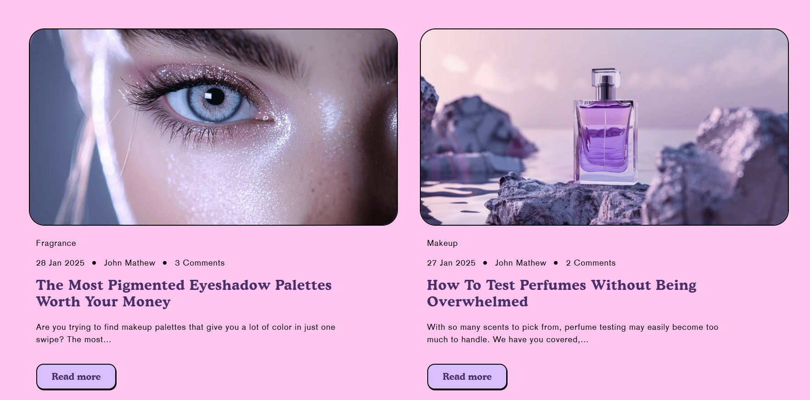

# Blog Posts

The **Blog Posts Section** allows you to display recent or featured blog posts on your Shopify store, helping to engage visitors and improve SEO. You can customize its layout, aspect ratio, text alignment, and enable features like author name, comments, and excerpts.


1. **Go to** Shopify Admin > **Online Store > Themes**.
2. Click **Customize** on your active theme.
3. In the Theme Editor, click **Add Section > Blog Posts**.


<figure><figcaption></figcaption></figure>

### **Settings & Customization**

<figure><figcaption></figcaption></figure>

**Blog Posts Settings**

**Layout**

* **Expand to Full Width**  :  Enable this option to extend the blog section across the entire screen width.
* **Color Scheme :**  Customize the section’s appearance by changing the text color, background color, and more using preset color options.
* **Background Opacity :**  Set the transparency level (Range: 0–100, Default: 100). This setting applies to the background image, which can be customized in the theme settings.

#### **Content Settings**

* **Heading** : Set a custom title (e.g., "Featured Blog").
* **Heading Size** : Choose from **Small, Medium, or Large** .
* **Text** : Add optional supporting text.
* **Text Position** : Select the position:
  * **Above Main Heading** : Position the text above the heading.
  * **Below Main Heading** : Position the text below the heading (Default).
* **Desktop Content Alignment** – Choose the text alignment for desktop **(Left, Right, or Center)**. The content alignment is automatically centered on mobile screens.

#### **Blog Card Settings**

* **Blog Category** : Choose the category to display (e.g., Blog, News).
* **Show Featured Image** : Enable to display the blog’s featured image.
* **Show Tags** : Display category tags for each blog post.
* **Show Date** : Show the blog post’s published date.
* **Show Author** : Display the author’s name.
* **Show Comment Count** : Show the number of comments.
* **Show Excerpts** : Display a short summary of the blog post.
* **Show Read More** : Enable a “Read More” button for expanded content.
* **Column alignment :** Choose the column alignment **Left, center, right.**
* **Aspect ratio -** There are 3 option image ratio as **( Adapt to image, square and portrait) c**an choose the required style as theme requirement.

#### **Column Settings**

* **Blog Posts Visible** : Set the total number of blog posts displayed.
* **Desktop Columns** : Choose the number of columns for desktop view (Options: 2, 3, 4).

#### **Carousel Settings**

* **Enable Carousel** : Activate a sliding format for product display.
* **Change Slides Every** : Set transition delay (in seconds). If set to 0, auto-play is disabled.
* **Gap** : Define spacing between items (Default: 30px, auto-adjusts for mobile).
* **Pagination** : Choose the pagination type: **Dots** (dot indicators), **Arrow** (manual navigation), or **None** (no indicators).
* **Pagination Style** : Choose the style: **Classic** (traditional) or **Modern** (updated look).\

#### **Section Padding**

* **Top Padding :** Adjust spacing above the section.
* **Bottom Padding :** Adjust spacing below the section.

#### Section divider

* **Shapes** : Adds shape effects to the section. Options: **( Curve Top, Curve Bottom, Curve Both, None, Border Top, Border Bottom, and Both Border)**.

