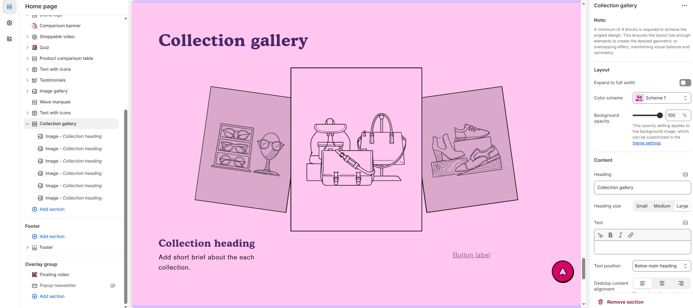

# Collection Gallery

The **Collection Gallery** section in Shopify is used to **showcase multiple product collections** (like "New Arrivals," "Best Sellers," or "Summer Sale") in a clean, grid-style layout — great for guiding customers to specific product categories.


1. **Go to** Shopify Admin > Online Store > Themes.
2. **Click** Customize on your live theme.
3. In the theme editor, **click** Add Section > **Collection gallery**


### **Settings & Customization**

<figure><figcaption></figcaption></figure>


#### Note: A minimum of 4 blocks is required to achieve the angled design. This ensures the layout has enough elements to create the desired geometric or overlapping effect, maintaining visual balance and symmetry


#### **Layout**

* **Expand to Full Width** : Enable this option to extend the announcement bar across the entire screen width.
* **Color scheme:** You can customize the section’s appearance by changing the **text color, background color**, and more using **preset color** options.
* **Background Opacity** : Set the transparency level (Range: 0–100, Default: 100).\
  This setting applies to the background image, which can be customized in the theme settings.

#### Content Settings

* **Heading:** Set a custom title (e.g., "Hot & Top Trends").
* **Heading Size:** Choose from **Small, Medium, or Large.**
* **Text :** Add additional text if needed.
* **Text Position :** Select the Position&#x20;
  * **Above Main Heading** : Position the subheading above the main heading.
  * **Below main heading :** Position the subheading below the main heading.
* **Desktop Content Alignment** – Choose the text alignment for desktop. **( Left, Right & Center ).** The content alignment is automatically centered on mobile screens.

#### **Carousel Settings**

* **Pagination** : Choose the pagination type: **Dots** (dot indicators), **Arrow** (manual navigation), or **None** (no indicators).
* **Pagination Style** : Choose the style: **Classic** (traditional) or **Modern** (updated look).
* **Change Slides Every** : Set the transition delay (in seconds). If set to 0, auto-play will be disabled.

#### Section padding

* **Top Padding :** Adjust spacing above the section.
* **Bottom Padding :** Adjust spacing below the section.

#### Section divider

* **Shapes** : Adds shape effects to the section. Options: **( Curve Top, Curve Bottom, Curve Both, None, Border Top, Border Bottom, and Both Border)**.

### Image block

* **Upload Image**: Select an image using the "Upload" or "Explore free images" option.
* **Heading :** Set a custom title (e.g., _"_&#x43;ollection Headin&#x67;_"_).
* **Text :** Add a brief text description to provide additional details about the image feature.
* **Button label :** Customize the button text.
* **Button link :** Paste a URL or use the search bar to link the button to a relevant page.
* **Open this link in a new window :**  Enable to open the link in a new tab.
* **Button style :** Choose the button style **(Primary, Secondary, or Hyperlink**_**).**_
