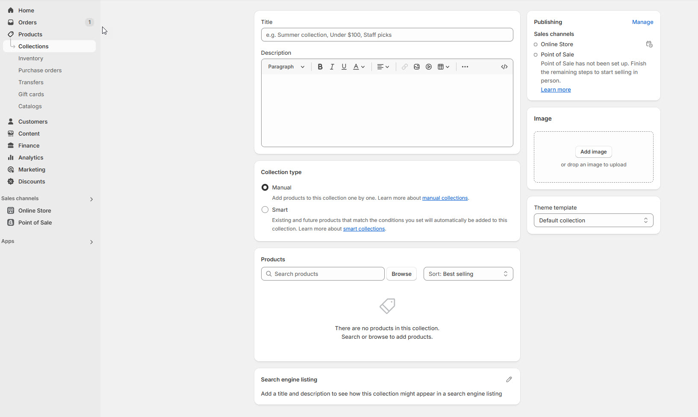

# Collections

Collections in Shopify allow you to group products into categories or themes, making it easier for customers to browse your store and find related items.

For example, you can create collections like **"Summer Clothing," "Best Sellers," or "On Sale.**

### **Types of Collections in Shopify** 

### **Manual Collections**:

* A **Manual Collection** requires you to **individually add products** to the collection.
* It gives **full control** over which products appear.

> **success:** 
1. **Go to** Shopify Admin > **Products > Collections**.
2. Click **Add Collection**.
3. Enter a **Title** and **Description**.
4. Under **Collection Type**, select **Manual**.
5. Click **Save** and then manually add products.

#### **Best Use Cases:**

* **Seasonal or Limited-Time Collections** (e.g., Holiday Specials).
* **Curated Product Lists** (e.g., Staff Picks, Best Sellers).
* **Exclusive or VIP Products** that require manual selection.

#### **Smart Collections**:

* An **Automated Collection** uses **rules and conditions** to dynamically add products.
* Products that match the set conditions are **automatically included** in the collection.

> **success:** 
1. **Go to** Shopify Admin > **Products > Collections**.
2. Click **Add Collection**.
3. Enter a **Title** and **Description**.
4. Under **Collection Type**, select **Automated**.
5. Set the **Conditions** (e.g., Product Tag = "New Arrival").
6. Click **Save** and products that match the rules will be added automatically.

#### **Best Use Cases:**

* **New Arrivals** (Automatically add new products).
* **Sale Items** (Include products based on price discounts).
* **Product Type-Based Collections** (e.g., All T-Shirts, Accessories).

<figure><figcaption></figcaption></figure>

### **Steps for Creating Automated Collections** 

1. **Set Conditions**:
   * Examples:
     * Product tag is "Summer."
     * Price is greater than $50.
     * Vendor is "Nike."
2. **Match Conditions**:
   * Decide if products must match **all** conditions or **any** condition.
3. **Automatic Addition**:
   * Products meeting the set conditions will be added to the collection automatically.

<figure><figcaption></figcaption></figure>

> **success:** 
**Note**: Ensure products are created and assigned to collections before setting them up.

### **Comparison: Manual vs. Automated Collections**

| Feature            | Manual Collection                        | Automated Collection                   |
| ------------------ | ---------------------------------------- | -------------------------------------- |
| Product Selection  | Manually added by store owner            | Added automatically based on rules     |
| Maintenance Effort | High (requires manual updates)           | Low (updates dynamically)              |
| Best For           | Curated collections, limited-time offers | Large catalogs, automatic organization |
| Example Use Case   | "Staff Picks" collection                 | "Under $50" collection                 |
