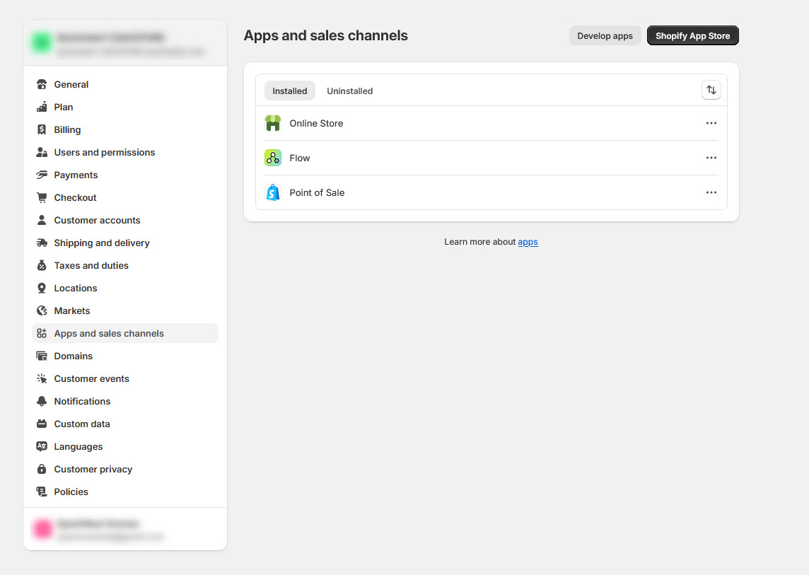
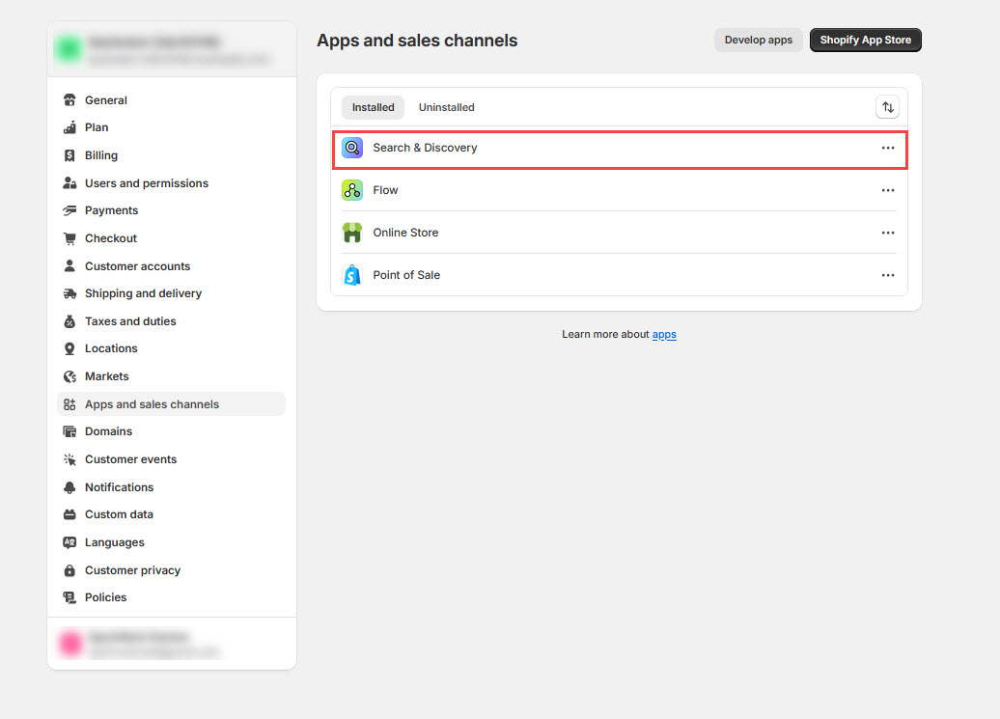

# Filters

Shopify’s **product filters** help customers refine their search on **collection pages** or **search results pages**. Filters are typically displayed as a **sidebar, dropdown menu, or drawer** to improve navigation and shopping experience

### **Built-in Shopify Filters**

* **Availability:** In stock / Out of stock
* **Price:** Allows filtering based on price range
* **Product Type:** Sort products by category (e.g., Shirts, Pants, Jackets)
* **Vendor (Brand):** Filters products by brand or manufacturer

<figure><figcaption></figcaption></figure>

***

### **Common Filter Types**

| **Filter Type**          | **Description**                                                                                 |
| ------------------------ | ----------------------------------------------------------------------------------------------- |
| **Price Filter**         | Customers can filter products based on price range (e.g., $0-$50, $50-$100).                    |
| **Size Filter**          | Displays available sizes (e.g., Small, Medium, Large).                                          |
| **Color Filter**         | Filters products by color options.                                                              |
| **Category/Type Filter** | Organizes products by category (e.g., Jackets, Shoes).                                          |
| **Brand Filter**         | Allows filtering by specific brands or manufacturers.                                           |
| **Material Filter**      | Filters based on product materials (e.g., Cotton, Leather).                                     |
| **Custom Filters**       | Includes unique filters like **occasion, style, or features** (e.g., waterproof, eco-friendly). |

### **Types of Filter Layouts**

* **Vertical Filter Layout** : Traditional sidebar filter layout.
* **Drawer Filter Layout** : Filters appear in a collapsible drawer (default for mobile).
* **Pagination Style** : Choose between **load more** or **numbered pages**.

### **How to Add Search & Discovery App in Shopify**

#### **Step 1: Install the App**

1. **Go to** Shopify Admin > **Apps**.
2. Click **Visit the Shopify App Store**.
3. Search for **Search & Discovery** and select the official Shopify app.
4. Click **Add App** and confirm installation.

#### **Step 2: Configure Filters**

1. Open **Shopify Admin > Apps > Search & Discovery**.
2. Navigate to **Filters** and click **Manage Filters**.
3. Click **Add Filter** and choose from options like **Price, Size, Brand, Material, etc.**
4. Click **Save** to apply the filters.

<figure><figcaption></figcaption></figure>

#### **Step 3: Test on Your Store**

1. Go to a **Collection Page** or **Search Results Page**.
2. Check if the filters appear and function correctly.
