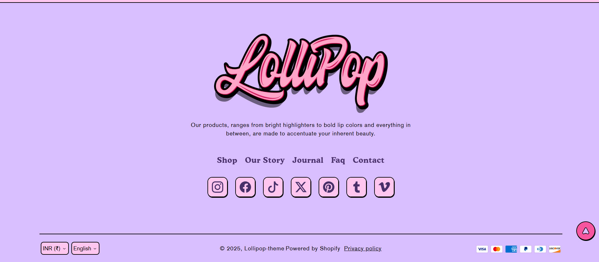
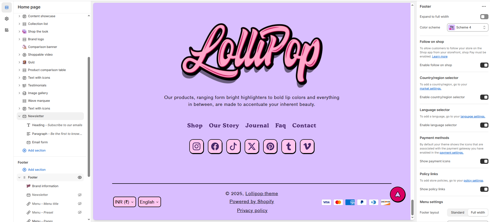

# Footer

The **Footer** section is a crucial part of your Shopify theme, providing essential information, navigation, and engagement tools for your customers. Customize its appearance and functionality to align with your store’s branding and user experience goals.


1. **Go to** Shopify Admin > Online Store > Themes.
2. **Click** **Customize** on your active theme.
3. **In the Theme Editor, click** **Footer** to access customization settings.


<figure><figcaption></figcaption></figure>

### Settings & Customization

<figure><figcaption></figcaption></figure>

#### **Layout**

* **Expand to Full Width:** Enable this option to extend the section across the entire screen width.
* **Color scheme:** You can customize the section’s appearance by changing the **text color, background color**, and more using **preset color** options.

#### **Shop Features**

* **Follow on Shop:** Allows customers to follow your store on the Shop app (requires Shop Pay to be enabled).
* **Enable Follow on Shop:** Toggle to enable or disable this feature.

#### **Selectors**

* **Country/Region Selector:** Allows users to switch between different countries/regions (configured in Market Settings).
* **Enable Country/Region Selector:** Toggle to enable or disable this feature.
* **Language Selector:** Enables language selection based on store language settings.
* **Enable Language Selector:** Toggle to enable or disable this feature.

#### **Payment & Policies**

* **Payment Methods:** Displays payment icons associated with the enabled payment gateways.
* **Show Payment Icons:** Toggle to show or hide payment icons.
* **Policy Links:** Provides quick access to store policies (configured in Policy Settings).
* **Show Policy Links:** Toggle to show or hide policy links.

**Menu Settings**&#x20;

* **Footer Layout**: Choose between Standard (default width) or Fullwidth (stretches across the screen).
* **Social Icon Style**: Select the style for social icons – **Classic, Modern, or Default.**
* **Desktop Alignment**: Set how footer content is aligned on desktop – options include Left, Center, or Right.

**Mobile Layout**:

* **Enable Collapse**: Toggle to collapse footer menus into expandable sections on mobile devices.
* **Mobile Alignment**: Align footer content on mobile – choose from **Left, Center, or Right**.
* **Toggle Icon**: Customize the icon used for expanding/collapsing footer menus on mobile view.

#### **Spacing & Padding**

* **Top Margin:** Adjust the top margin of the footer.
* **Section Padding:** Customize spacing above and below the footer. (eg., Top: 100px, Bottom: 100px)

#### **Section divideer**

* **Shapes:** Adds shape effects to the footer section. (Options: **None, Border Top**)
* **Border Top:** Adds a top border to the footer for better visual separation.
