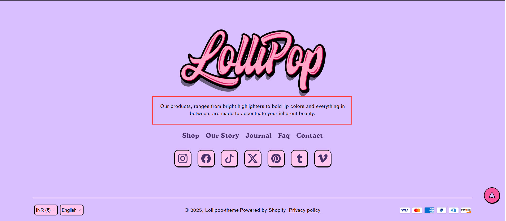

# Brand information

The **Brand Information** section in Shopify allows you to showcase your store's branding, including your **brand name, logo, description, colors, and social media links**. This helps customers recognize and trust your brand.

> **success:** 
1. Go to **Online Store > Themes > Customize**.
2. Navigate to the **Footer** section.
3. Look for **Brand Information** settings.
4. Enter details like your brand name, tagline, or description.
5. Click **Save** to apply changes.

<figure><figcaption></figcaption></figure>

**Settings & Customization**

* **Description :** This block displays your brand information. Edit the [Brand details](../../theme-settings/brand-information.md) as needed.&#x20;
* **Enable Menu Title:** Toggle to show or hide the menu title.

> **success:** 
[**Brand Information**](../../theme-settings/brand-information.md)

