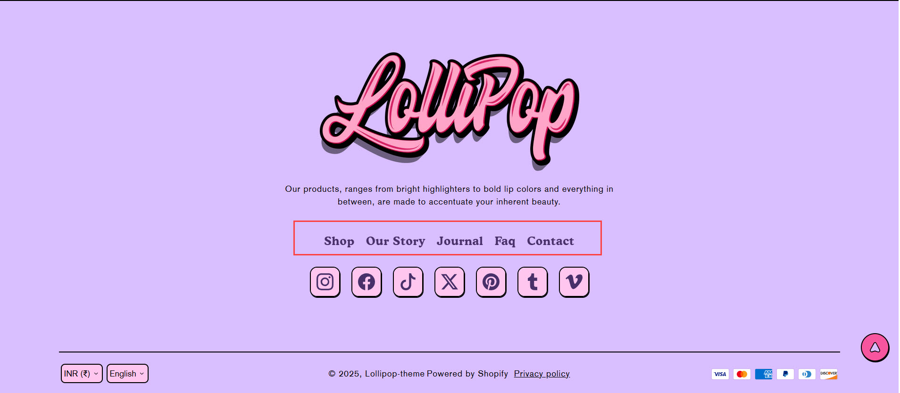
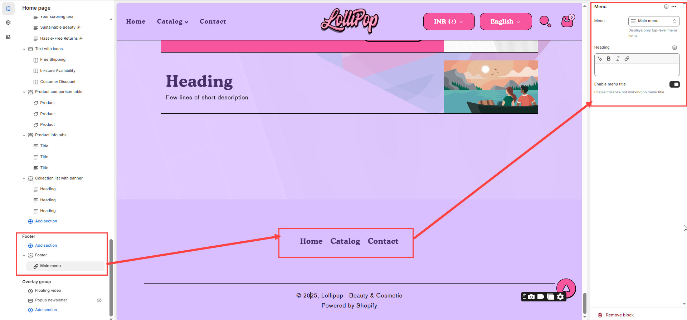

# Menu

The **Menu Block** in the Footer Section allows you to display **navigation links**, providing quick access to important pages such as **About Us, Contact, FAQs, Policies, and Categories**.


1. **Go to** Shopify Admin > **Online Store > Themes**.
2. Click **Customize** on your active theme.
3. Navigate to **Footer Section > Add Block > Menu**.
4. Configure the settings as needed.


<figure><figcaption>
Fo<strong>oter Section > Add Block > Menu</strong>.
</figcaption></figure>

### **Settings & Customization**

<figure><figcaption></figcaption></figure>

* **Menu:** Choose a menu to display in the footer added in [**Navigation**](https://help.shopify.com/en/manual/online-store/menus-and-links/editing-menus).
* **Heading:** Adds heading to the footer menu


**Note :** Displays Only Top-Level Menu Items submenu items will not be shown.


**Menu Heading**

* **Heading:** Set a custom title for the menu section.
* **Enable Menu Title:** Toggle to show or hide the menu title.
* **Enable Collapse:** This feature allows menu items to be collapsible, but it does not apply to the menu title.
