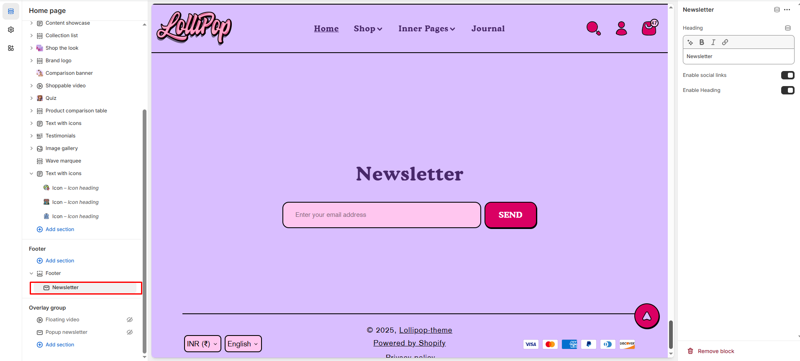

# Newsletter

The **Newsletter Block** in the Footer Section allows customers to **subscribe to email updates, promotions, and brand news**, helping you grow your email marketing list.

> **success:** 
1. **Go to** Shopify Admin > **Online Store > Themes**.
2. Click **Customize** on your active theme.
3. Navigate to **Footer Section > Add Block > Newsletter**.
4. Configure the settings as needed.

**Subscribers are added automatically** to your **"accepted marketing" customer list**.

<figure><figcaption></figcaption></figure>

**Heading**

* **Heading:** Set a custom title for the newsletter section. ( Example: Newsletter )
* **Enable Social Links:** Toggle to show or hide social media icons below the newsletter signup form.
* **Enable Heading :** Toggle to display a title above the newsletter section (commonly used for organizational purposes).
