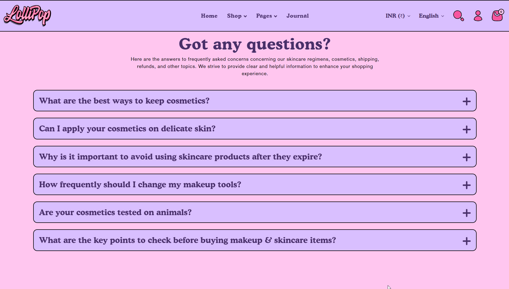
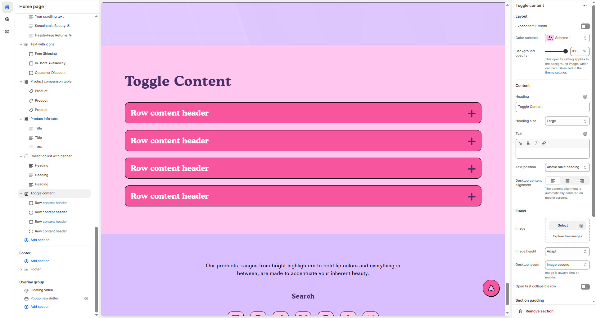

# Frequently asked questions

**Toggle Content** a collapsible section that expands or hides content when clicked—ideal for FAQs, product details, or policies.


1. **Go to** Shopify Admin > **Online Store > Themes**.
2. Click **Customize** on your active theme.
3. In the Theme Editor, click **Add Section >Toggle conten**t


<figure><figcaption></figcaption></figure>

### **Settings & Customization**

<figure><figcaption></figcaption></figure>

#### **Layout** 

* **Expand to Full Width:** Enable this option to extend the section across the entire screen width.
* **Color scheme:** You can customize the section’s appearance by changing the **text color, background color**, and more using **preset color** options.
* **Background Opacity:** Adjust transparency (Range: 0–100 %, Default: 100%). This applies to the background image, customizable in theme settings.
* **Block color scheme:** You can customize the block's appearance by changing the **text color, background color**, and more using **preset color** options.

#### **Content Settings**

* **Heading:** Set a custom title (e.g., _"_&#x57;e’re are featured b&#x79;_"_).
* **Heading Size:** Choose from **Small, Medium, or Large**.
* **Text:** Add optional supporting text.
* **Text Position:**
  * **Above Main Heading** : Position the text above the heading.
  * **Below Main Heading** : Position the text below the heading.
* **Desktop Content Alignment:** Choose from **Left, Right, or Center** (Automatically centered on mobile screens).

**Image Settings**

* **Upload Image**: Select an image using the "Upload" or "Explore free images" option.
* **Image Height**: Set the banner height to **Adapt, Small, Medium, or Large**.
* **Desktop Image Placement:** Options: **Image First** and **Image second** (default for mobile layout).
* **Collapsible Row Behavior**: Enable **Open First Collapsible Row** to expand the first row by default.

#### Section padding 

* **Top Padding:** Adjust spacing above the section.
* **Bottom Padding:** Adjust spacing below the section.

#### Section divider

* **Shapes** : Adds shape effects to the section. Options: **( Curve Top, Curve Bottom, Curve Both, None, Border Top, Border Bottom, and Both Border)**.

### Collapsible row

* **Heading :** Add text to show as a title inside the collapsible row.
* **Icon :** Choose any icon from the list.
* **Row content :** Add text to show as the description.
* **Row content from page :** Add page to show as the description.

