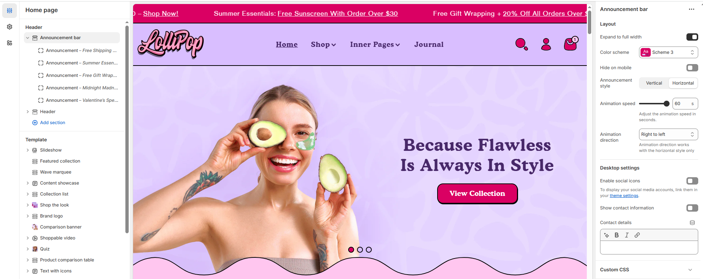
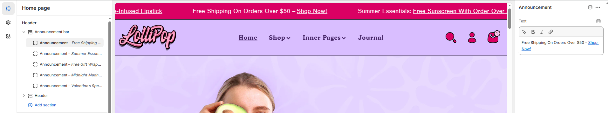

# Announcement Bar

The **Announcement Bar Section** allows you to display important messages, promotions, or updates at the top of your store. It enhances customer engagement and improves visibility for key information.

<figure><figcaption></figcaption></figure>


1. **Go to** Shopify Admin > Online Store > Themes.
2. **Click** **Customize** on your active theme.
3. In the theme editor, **click** **Add Section > Announcement Bar**.


<figure><figcaption></figcaption></figure>

### Settings & Customization

**Layout & Display Options**

* **Make Section Full Width** : Enable this option to extend the announcement bar across the entire screen width.
* **Color scheme:** You can customize the section’s appearance by changing the **text color, background color**, and more using **preset color** options.
* **Hide on Mobile** : Enable/disable the announcement bar on mobile devices as needed

**Slide Settings**

* **Announcement Style** : Select between **Vertical** or **Horizontal** display.
* **Animation Speed** : Adjust the animation speed for desired effect (Set to **60** for smooth scrolling.)
* **Animation Direction** : Choose **Left to Right** (works only in **Horizontal** style).

**Desktop Settings**

* **Enable Social Icons** : Enable to display social media icons linked to your store’s accounts (ensure accounts are added in [Theme Settings](../theme-settings/social-icon.md) ).
* **Show Contact Information** – Display store details for easy customer access.

### Add an Announcement

<figure><figcaption></figcaption></figure>


Go to **Shopify Admin > Online Store > Themes > Customize > click Announcement Bar > Add Announcement.**


**Add Announcement**&#x20;

**Text**

* Add a message to display in the announcement bar.
* Such as: **"Subscribe & get 5% off on all paintings**."

