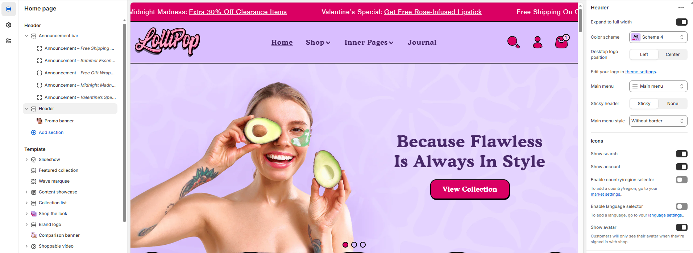

# Header

The **Header Section** allows you to customize the top section of your store, including navigation, branding, and search functionality. It provides a structured layout to enhance user experience and accessibility.


1. **Go to** Shopify Admin > Online Store > Themes.
2. **Click** **Customize** on your active theme.
3. **In the Theme Editor, click** **Header** to access customization settings.


### Settings & Customization

<figure><figcaption></figcaption></figure>

* **Make Section Full Width** : Enable this option to extend the announcement bar across the entire screen width.
* **Color scheme:** You can customize the section’s appearance by changing the **text color, background color**, and more using **preset color** options.
* &#x20;**Logo Position :** Set the logo position in the header:
  * **Middle Left**: Aligns the logo to the left.
  * **Middle Center** : Centers the logo.
  * **Note**: Edit your logo in [**Theme Settings**](broken-reference).
* **Menu:** To add, remove, or edit menus in your Shopify store, please refer to: [Editing menus](https://help.shopify.com/en/manual/online-store/menus-and-links/editing-menus)
* **Header Type :** You can enable or disable the **Sticky** header option.
* **Menu Style :** You can select either **With Border** or **Without Border**.

#### **Header Icons**

* **Search** : Enable or disable the search icon in the header.
* **Account** : Enable or disable  the account icon for customer login.
* **Enable Country/Region Selector** : Allow customers to switch regions.
  * To add a country/region, go to[ **Market Settings**](https://help.shopify.com/en/manual/international/managed-markets/setting-up).
* **Enable Language Selector** : Allow customers to change the store’s language.
  * To add a language, go to [**Language Settings**](https://help.shopify.com/en/manual/international/languages/manage-languages).
* **Show Avatar** : Customers will see their avatar only when signed in with **Shop**.
