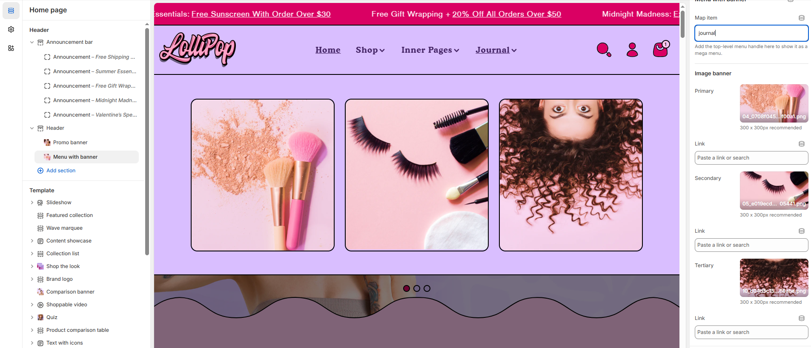

# Menu with banner

The **Menu with banner** feature allows you to display promotional images within a **megamenu**, enhancing navigation with visual content such as **offers or banners**.


1. **Go to** Shopify Admin > **Online Store > Themes**.
2. Click **Customize** on your active theme.
3. Navigate to **Header Section > Add block > Menu with banner**
4. Configure the settings as needed.


<figure><figcaption></figcaption></figure>

#### **Menu with Banner**

<figure><figcaption></figcaption></figure>

#### **Map Item**

* **Map Item (Menu Handle)**:\
  Enter the top-level menu handle (e.g., Catalog) to connect this banner with the correct menu item.\
  If your handle has spaces, use hyphens instead (e.g., new-arrivals).

#### **Image Banner Settings**

You can add up to three banner images—Primary, Secondary, and Tertiary. Each can have its own destination link.

* **Primary Banner**
  * **Image**: Upload the main banner image.
  * **Link**: Paste a URL or search to link the image to a collection, product, or page.
* **Secondary Banner** (Optional)
  * **Image**: Upload a secondary image to complement the primary.
  * **Link**: Add a link to direct users to another relevant destination.
* **Tertiary Banner** (Optional)
  * **Image**: Upload a third image for additional promotion.
  * **Link**: Set a final link for user interaction.

#### **Usage Notes**

* These banners only appear within the dropdown mega menu for the specified menu item.
* Make sure images are optimized for fast loading.
* Keep banners visually distinct but consistent with your brand style.
