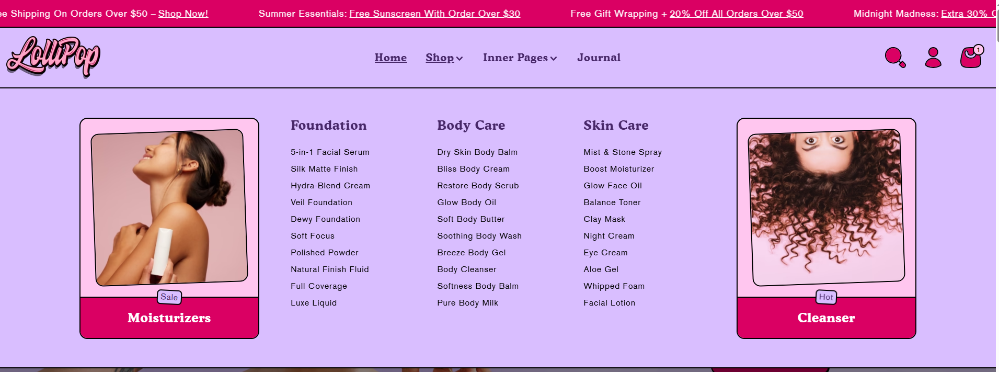

# Promo banner

The **Promo Banner** feature allows you to display **promotional banners** within a **megamenu**, enhancing navigation with visual content such as **special offers, featured products, or announcements**.

> **success:** 
1. **Go to** Shopify Admin > **Online Store > Themes**.
2. Click **Customize** on your active theme.
3. Navigate to **Header Section >Add block > Add Promo Banner**.
4. Configure the settings as needed.

<figure><figcaption></figcaption></figure>

#### **Promo Banner**

<figure><figcaption></figcaption></figure>

#### **Promo Banner**

This section displays promotional banners inside your mega menu, allowing you to highlight specific collections, sales, or featured products.

#### **Map Item**

* **Map Item (Menu Handle)**:\
  Enter the top-level menu handle (e.g., `shop`) to attach the promo banner to the corresponding menu.\
  If the handle contains spaces, replace them with hyphens (e.g., `new-arrivals`).

#### **Banner Style**

* **Banner Layout Options**: Banner styling options will only appear after selecting an image below.
  * **Both Side** – Displays banners on both the left and right sides.
  * **Start** – Displays the banner on the left side of the dropdown.
  * **End** – Displays the banner on the right side of the dropdown.

> _Note: Styling options appear only after uploading images._

#### **Banner Color Scheme**

* **Color Scheme** : You can customize the section’s appearance by changing the **text color, background color**, and more using **preset color** options.

#### **Primary Banner**

* **Image**: Upload a banner image.
* **Heading**: Enter the title or label (e.g., Moisturizers).
* **Caption**: Add a short caption or tagline (optional).
* **Link**: Enter a link to a collection or product (e.g., `shopify://collections/cleansers`).

#### **Secondary Banner**

* **Image**: Upload another banner image for additional promotion.
* **Heading**: Enter the title (e.g., Cleanser).
* **Caption**: Add a short caption (e.g., hot).
* **Link**: Enter a link (e.g., `shopify://collections/eye-cosmetics`).
