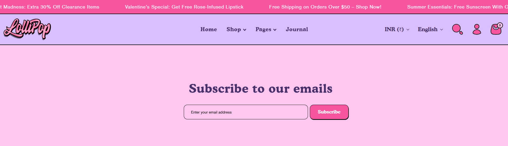
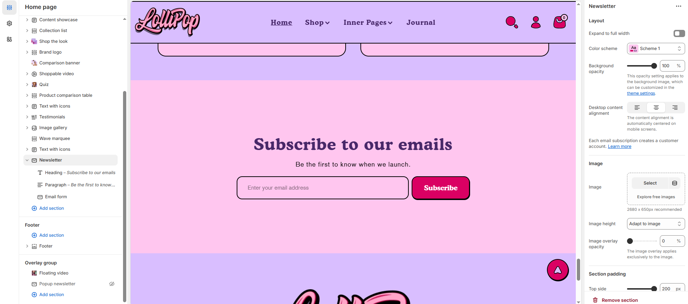

# Newsletter

The **Newsletter Section** allows customers to subscribe to email updates, promotions, and exclusive content. This helps businesses grow their email lists and keep customers engaged with regular updates.


1. **Go to** Shopify Admin > **Online Store > Themes**.
2. Click **Customize** on your active theme.
3. In the Theme Editor, click **Add Section > Newsletter**.


<figure><figcaption></figcaption></figure>

### **Settings & Customization**

<figure><figcaption></figcaption></figure>

#### **Layout** 

* **Expand to Full Width:** Enable this option to extend the section across the entire screen width.
* **Color scheme:** You can customize the section’s appearance by changing the **text color, background color**, and more using **preset color** options.
* **Background Opacity:** Set the transparency level (Range: 0–100, Default: 100). This applies to the background image, which can be customized in the theme settings.
* **Desktop Content Alignment:** Choose from **Left, Right, or Center** (Automatically centered on mobile screens).
* **Each email subscription creates a customer account.** [**Learn more**](https://help.shopify.com/manual/customers)

#### **Image Settings** 

* **Upload Image:** Select an image or explore free images.
* **Image Height:** Set the Image height to _Adapt, Small, Medium, or Large_ (Default: Adapt).
* **Image overlay Opacity:** Set the overlay transparency level (Range: **0–100**, Default: **100**). This applies to the background image, which can be customized in the theme settings.

#### Section padding 

* **Top & Bottom Padding:** Adjust the spacing above and below the section for a well-structured layout.

#### Section divider

* **Shapes** : Adds shape effects to the section. Options: **( Curve Top, Curve Bottom, Curve Both, None, Border Top, Border Bottom, and Both Border)**.
