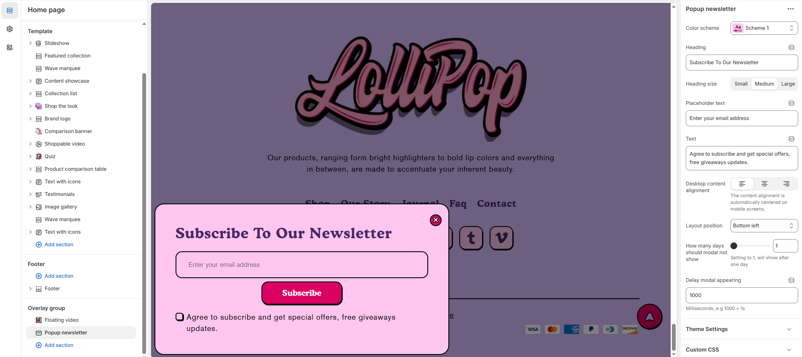

# Popup Newsletter

The **Popup Newsletter Section** allows customers to subscribe to email updates, promotions, and exclusive content. It helps businesses grow their email lists and engage with customers through newsletters.


1. **Go to** Shopify Admin > **Online Store > Themes**.
2. Click **Customize** on your active theme.
3. In the Theme Editor, click **Overlay Group >** **Section > Popup Newsletter**&#x20;


### **Settings & Customization**

<figure><figcaption></figcaption></figure>

#### **Popup Newsletter Settings**

* **Color Scheme** : Customize the appearance using preset color options.
* **Heading** : Set a custom title (e.g., "Subscribe to our Newsletter").
* **Placeholder Text** : Customize the email input field placeholder (e.g., "Enter your email address").
* **Heading Size** : Choose from **Small, Medium, or Large** (Default: Medium).
* **Desktop Content Alignment** : Choose text alignment (Left, Right, or Center).
* **Text** : Add a short description (e.g., "Agree to subscribe and get special offers, free giveaways, and updates.").
* **Layout Position** : Choose where the popup appears on the screen (e.g., **Bottom Left**).
* **How Many Days Should Modal Not Show** : Set how many days the popup should stay hidden after a user closes it (Default: **1 day**).
* **Delay Modal Appearing** : Set the delay before the popup appears (Default: **1000ms** = 1s).

#### **Additional Settings**

* **Theme Settings** : Modify design elements through theme options.
* **Custom CSS** : Add custom styling to personalize the popup further.
