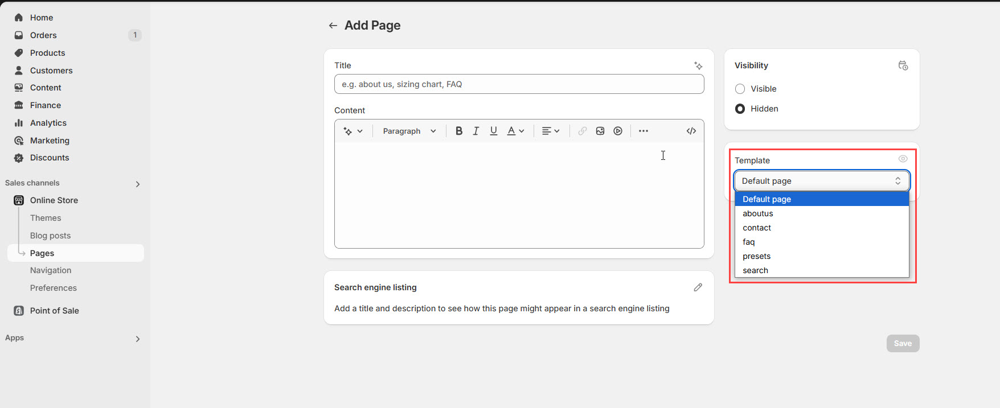

# Pages

Creating pages in Shopify allows you to add essential content like **About Us, Contact, FAQs, Policies, and Custom Landing Pages** to your store.

<figure><figcaption></figcaption></figure>

### **Step 1: Navigate to Pages**

1. **Go to** Shopify Admin > **Online Store > Pages**.
2. Click **Add Page**.

### **Step 2: Enter Page Details**

1. **Title:** Enter a title (e.g., **"About Us"**).
2. **Content:** Add text, images, videos, or embedded code.
3. **Visibility:** Choose **Visible** to publish or **Hidden** to save as a draft.

### **Step 3: Customize SEO Settings (Optional)**

1. Click **Edit Website SEO**.
2. Add a **Page title, Meta description, and URL handle** for better search visibility.

### **Step 4: Save & Publish**

1. Click **Save** to store changes.
2. If ready, ensure the page is **Visible** and published on your store.

### **Step 5: Add the Page to Navigation (Optional)**

1. **Go to** Shopify Admin > **Online Store > Navigation**.
2. Click **Main Menu** or **Footer Menu**.
3. Click **Add Menu Item**, enter the **Page Name**, and select the created page.
4. Click **Save Menu** to make it accessible on your store.

### **Best Practices**

* Use **clear and concise titles** to help customers navigate easily.
* Optimize SEO settings for **better search rankings**.
* Organize pages in the **navigation menu** for easy access.
