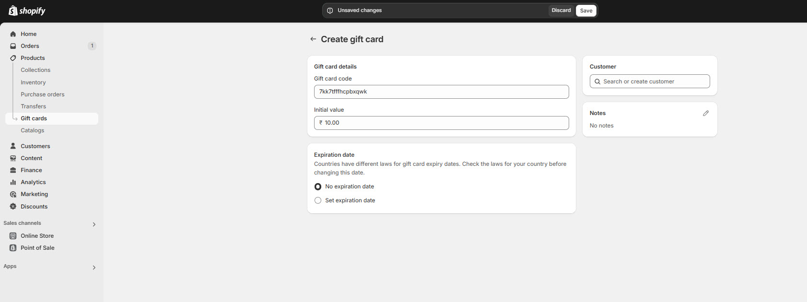

# Gift Cards

**Gift cards** provide customers with a flexible payment option, allowing them to purchase store credit for themselves or others. This guide outlines how to set up and enable gift cards in your Shopify store.

<figure><figcaption>
<strong>Products > Gift Cards</strong>.
</figcaption></figure>

### **Step 1: Navigate to Gift Cards**

1. **Go to** Shopify Admin > **Products > Gift Cards**.

### **Step 2: Create a New Gift Card**

1. Click **Create Gift Card**.
2. Set the following details:
   * **Title** (e.g., **"Holiday Gift Card"**)
   * **Value** (e.g., **$25, $50, $100**)
   * **Optional Expiration Date**
   * **Message** (e.g., **"A perfect gift for any occasion!"**)
3. Click **Save** to create the gift card.

### **Step 3: Enable Gift Card in Cart**

1. **Go to** Customizer > **Theme Settings > Cart**.
2. Enable the **Gift Card Option** to allow customers to apply it as a discount during checkout.

### **Best Practices**

* Offer **multiple gift card values** to cater to different budgets.
* Add **custom branding** to the gift card design for a professional look.
