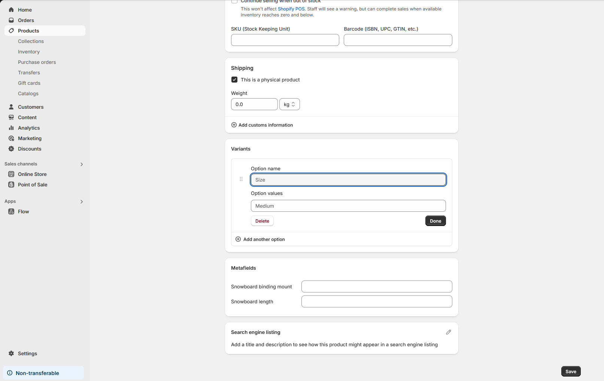

# Product Variants

**Product Variants** allow you to offer different options for a single product, such as size, color, material, or style. This feature helps streamline your product catalog and provides customers with more choices. Below is a guide to creating and managing product variants in Shopify.

> **success:** 
**Note :** Variants are based on options, which are characteristics of the product (e.g., size, color). Each product can have up to 3 options (e.g., Size, Color, Material).

### &#x20;**Add Variants to a Product**

### **Step 1: Add Variants to a Product**

1. Go to **Shopify Admin > Products**.
2. Select an existing product or create a new one.
3. Scroll down to the **Variants** section.
4. Enable **This product has multiple options** (e.g., size, color).

<figure><figcaption></figcaption></figure>

### **Step 2: Configure Variant Options**

1. **Option Name**: Enter the type of option (e.g., Size, Color).
2. **Option Values**: Add the available choices (e.g., Small, Medium, Large or Red, Blue, Green).
3. Click **Add another option** if you need more than one variant type (e.g., Size **and** Color).

### **Step 3: Customize Variant Details**

For each variant, you can specify:

* **Price**: Set a unique price for the variant (if different from the base product).
* **SKU**: Add a unique stock-keeping unit for inventory tracking.
* **Barcode**: Enter a barcode for the variant (if applicable).
* **Inventory**: Manage stock levels for each variant.
* **Weight**: Add the variant’s weight for shipping calculations.

### **Step 4: Add Media for Variants**

1. Upload images or videos for each variant (e.g., a red shirt image for the “Red” color variant).
2. Assign media to the corresponding variant in the **Media** section.

### **Step 5: Save and Preview**

1. Click **Save** to apply the changes.
2. Preview the product on your storefront to ensure variants display correctly.

### **Managing Variants**

#### **Bulk Editing Variants**

1. Go to **Shopify Admin > Products**.
2. Select a product with variants.
3. Click **Edit Variants** to update multiple variants at once (e.g., adjust prices or inventory).

#### **Deleting Variants**

1. In the **Variants** section, click the trash icon next to the variant you want to remove.
2. Confirm the deletion.

