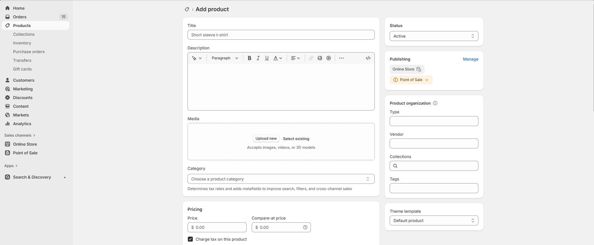

# Products Page

A **Products Page** in Shopify allows you to showcase and manage your store’s products efficiently. You can create a dedicated page to display your items, add product details, and optimize the layout for better customer experience.

### How to Create a Products Page

> **success:** 
1. **Go to** Shopify Admin > **Products**.
2. Click **Add Product**.
3. Enter the **Product Title, Description, and Price**.
4. Upload **high-quality images** of your product.
5. Set up **Inventory & Shipping details** (if applicable).
6. Click **Save**.

<figure><figcaption></figcaption></figure>

### **Product Details & Pricing**

#### **Add Product Information**

* Ensure you include all required details like **Title, Price, and Description** for clarity.

#### **Pricing Options**

* **Price:** Enter the selling price of the product in the price field.
* **Compare at Price:** Enter a higher or original price to indicate a discount.
* **Tax Checkbox:** Select this option to indicate whether the product is taxable.

#### **Cost & Profit Calculation**

* **Cost per Item:** Enter the manufacturing or purchase cost of the product.
* **Profit:** Displays the automatically calculated profit based on the price and cost.
* **Margin:** Shows the profit margin percentage.
