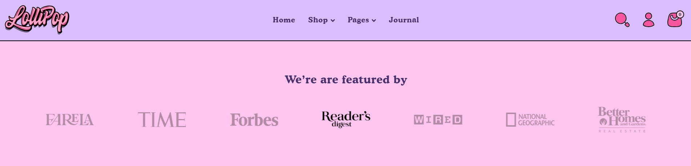
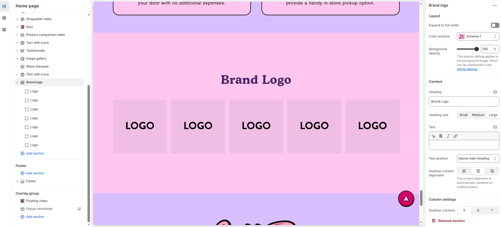
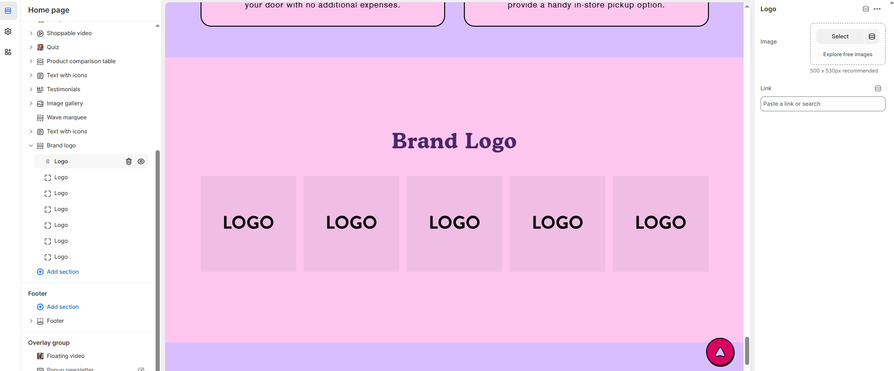

# Brand logo

The **Brand Logo** section allows you to display logos in a structured layout, enhancing brand recognition and credibility. This section is ideal for showcasing your own logo, trusted brands, media mentions, or partner collaborations.

> **success:** 
1. **Go to Shopify Admin** > Online Store > Themes.
2. Click **Customize** on your active theme.
3. Click **Add Section** > **Brand Logo.**
4. Upload your logo or a collection of logos.
5. Adjust **size, spacing, and alignment** to fit your store’s layout.

<figure><figcaption></figcaption></figure>

### **Settings & Customization**

<figure><figcaption></figcaption></figure>

#### **Layout** 

* **Expand to Full Width:** Enable this option to extend the section across the entire screen width.
* **Color scheme:** You can customize the section’s appearance by changing the **text color, background color**, and more using **preset color** options.
* **Background Opacity:** Set the transparency level (Range: 0–100, Default: 100). This applies to the background image, which can be customized in the theme settings.

#### **Content Settings**

* **Heading:** Set a custom title (e.g., _"_&#x57;e’re are featured b&#x79;_"_).
* **Heading Size:** Choose from **Small, Medium, or Large**.
* **Text:** Add optional supporting text.
* **Text Position:**
  * **Above Main Heading** : Position the text above the heading.
  * **Below Main Heading** : Position the text below the heading.
* **Desktop Content Alignment:** Choose from **Left, Right, or Center** (Automatically centered on mobile screens).

#### **Column Settings**

* **Desktop Columns** : Choose the number of columns for desktop view. (Options: 5, 6, or 7)
* **Mobile Columns** : Choose the number of columns for mobile view. (Options: 2 or 3)

#### **Carousel Settings** 

* **Enable Carousel** : Enable to display products in a sliding carousel format.
* **Centered Mode :**  Enable to display logo in centered mode.
* **Change Slides Every:** Set transition delay (in seconds). If set to 0, auto-play is disabled.
* **Gap:** Define spacing between items (Default: 30px, auto-adjusts for mobile).
* **Pagination** : Choose the pagination type: **Arrow** (manual navigation), or **None** (no indicators).
* **Pagination Style** : Choose the style: **Classic** (traditional) or **Modern** (updated look).

#### Section padding 

* **Top Padding:** Adjust spacing above the section.
* **Bottom Padding:** Adjust spacing below the section.

#### Section divider

* **Shapes** : Adds shape effects to the section. Options: **( Curve Top, Curve Bottom, Curve Both, None, Border Top, Border Bottom, and Both Border)**.

<figure><figcaption></figcaption></figure>

#### **Logo Settings**

* **Image** : Upload an image for the logo.&#x20;
* **Link** : Add a link for the logo. (e.g., shopify://products/facial-serum)
