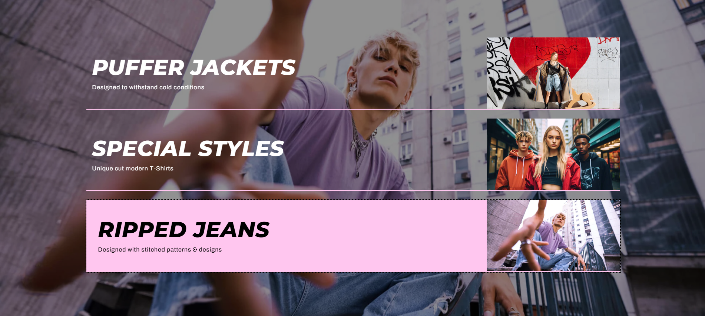
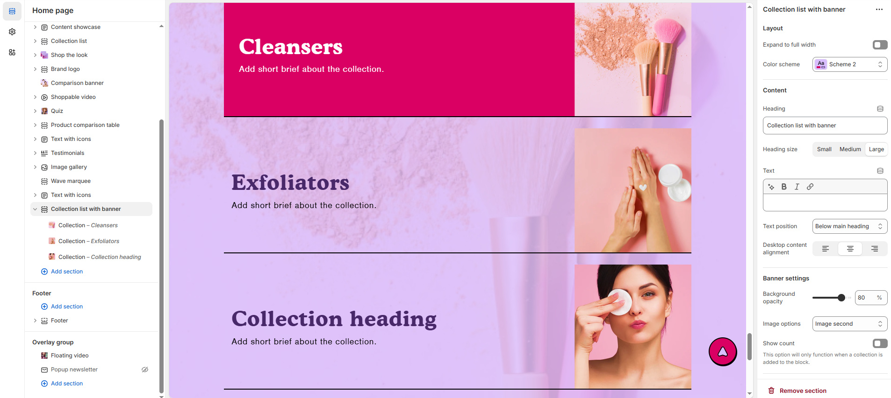
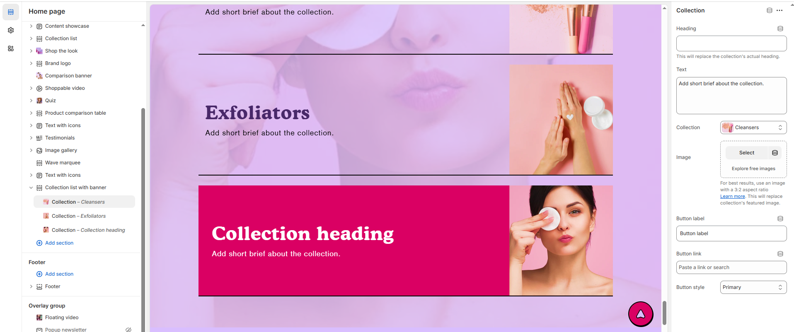

# Collection list with Banner

The **Collection List with Banner** section allows you to display multiple product collections with featured images and banners. This section is ideal for highlighting seasonal sales, new arrivals, or curated product categories in an engaging way.

> **success:** 
1. **Go to Shopify Admin** > Online Store > Themes.
2. Click **Customize** on your active theme.
3. In the theme editor, click **Add Section** > **Collection list with banner**.
4. Choose the collections you want to display.
5. Customize the **banner text, layout, and images** to match your store’s branding.

<figure><figcaption></figcaption></figure>

### **Settings & Customization**

<figure><figcaption></figcaption></figure>

#### **Layout Settings**

* **Expand to Full Width:** Enable this option to stretch the section across the entire screen width.
* **Color scheme :** You can customize the section’s appearance by changing the **text color, background color**, and more using preset color options.
* **Background Opacity:** Adjust the transparency level (Range: 0–100, Default: 100). This setting applies to the background image, which can be customized in the theme settings.

#### **Content**&#x20;

* **Heading:** Set a custom title (e.g., "Collection List with Banner")
* **Heading Size:** Choose from **Small, Medium, or Large**.
* **Text:** Add optional supporting text.
* **Text Position:**
  * **Above Main Heading :** Position the subheading above the main heading.
  * **Below Main Heading :** Position the subheading below the main heading.
* **Desktop Content Alignment:** Set text alignment for desktop **(Left, Center, or Right)**.

#### **Banner Settings**

* **Background Opacity:** Adjust transparency level (Range: 0–100, Default: 80).
* **Image Options:** Select between **First** or **Second** Image.
* **Show Count:** Display the number of products in the collection. This option only functions when a collection is added to the block.

#### **Section Padding**

* **Top Padding:** Adjust the spacing above the section.
* **Bottom Padding:** Adjust the spacing below the section.

#### Section divider

* **Shapes** : Adds shape effects to the section. Options: **( Curve Top, Curve Bottom, Curve Both, None, Border Top, Border Bottom, and Both Border)**.

### **Collection List with Banner – Add Image**

<figure><figcaption></figcaption></figure>

**Image Settings**

* **Heading:** Customize the heading for this banner section. This will replace the collection’s actual heading.
* **Content:** Add a few lines of a short description.
* **Collection:** Select the collection to be displayed in this block.
* **Upload Image:** Select an image to replace the collection’s featured image.
* **Button Label:** Customize the button text (e.g., "Shop Now" or "View Collection").
* **Button Style:** Choose from predefined styles **(Primary, Secondary, or Custom).**

