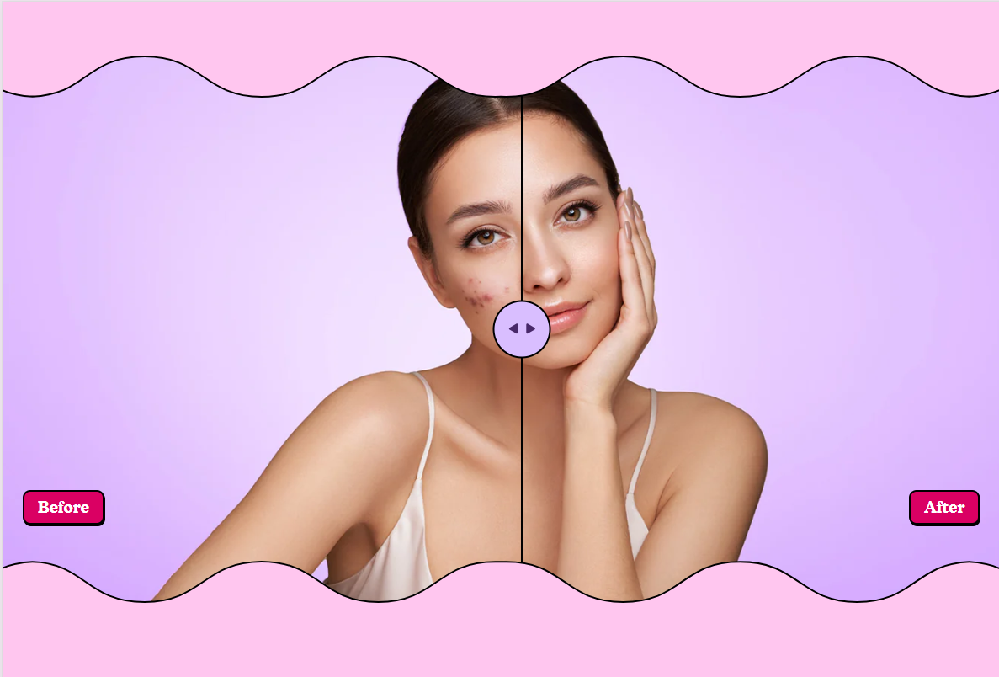
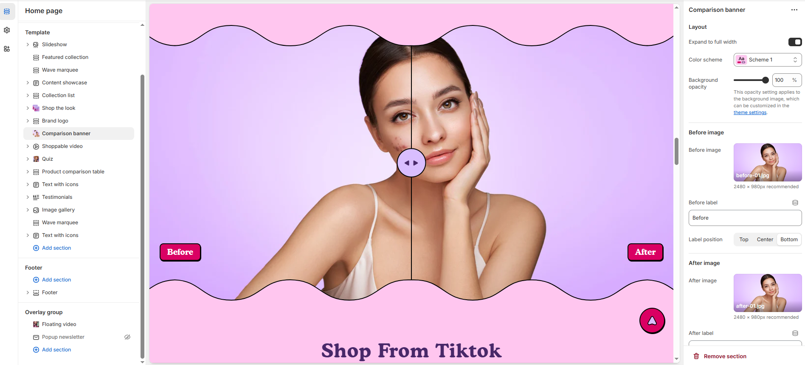

# Comparison Banner

The **Comparison Banner** is a dynamic section that allows you to compare two or more products, services, or features side-by-side. It's ideal for showcasing key differences between similar products, helping customers quickly identify which option best suits their needs.


1. **Go to Shopify Admin** > Online Store > Themes.
2. Click **Customize** on your active theme.
3. In the theme editor, click **Add Section** > **Comparison Banner.**
4. Customize the section by adding **images, pricing, and key feature comparisons**.


<figure><figcaption></figcaption></figure>

### **Settings & Customization**

<figure><figcaption></figcaption></figure>

#### **Layout**

* **Expand to Full Width:** Enable this option to extend the banner across the entire screen width.
* **Color scheme:** You can customize the section’s appearance by changing the **text color, background color**, and more using **preset color** options.
* **Background Opacity:** Adjust transparency (Range: 0–100, Default: 100). This setting applies to the background image, customizable in theme settings.

#### **Before & After Image Settings**

* **Before Image:** Upload an image (Recommended size: 2480 × 980px).
* **Before Label:** Set a custom label (Default: "Before").
* **Text Position:** Choose **Top, Center, or Bottom** (automatically optimized for mobile).
* **After Image:** Upload an image (Recommended size: 2480 × 980px).
* **After Label:** Set a custom label (Default: "After").
* **Text Position:** Choose **Top, Center, or Bottom** (automatically optimized for mobile).

#### Section divider

* **Shapes** : Adds shape effects to the section. Options: **( Curve Top, Curve Bottom, Curve Both, None, Border Top, Border Bottom, and Both Border)**.

