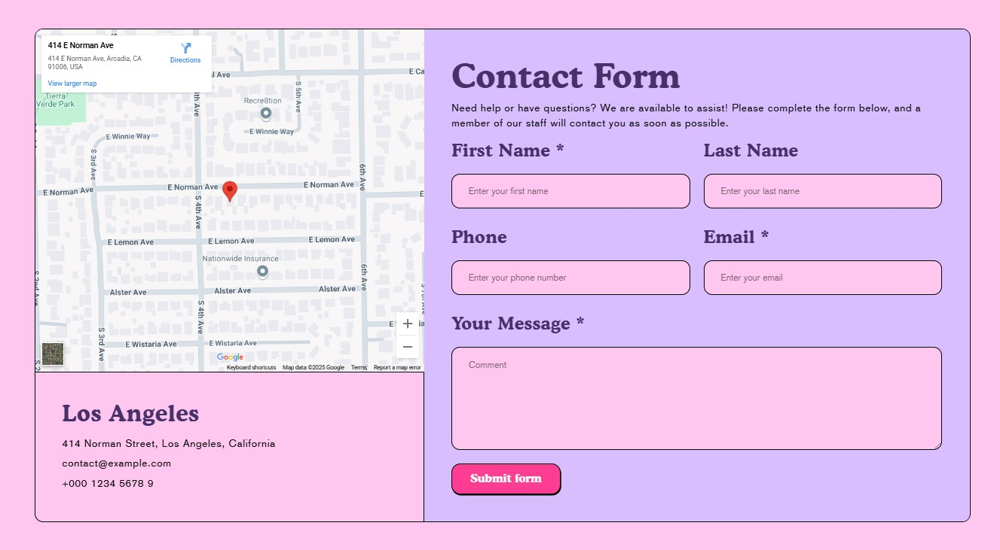
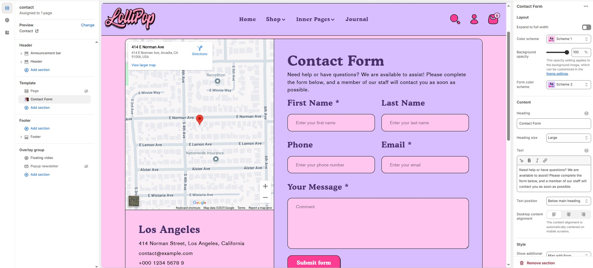

# Contact Form

The **Contact Form** allows customers to reach out to you directly from your website. It's commonly used for support, inquiries, or custom order requests.

> **success:** 
1. **Go to Shopify Admin** > Online Store > Themes.
2. Click **Customize** on your active theme.
3. Click **Add Section** >  Contact Form

<figure><figcaption></figcaption></figure>

### **Settings & Customization**

<figure><figcaption></figcaption></figure>

#### **Layout** 

* **Expand to Full Width:** Enable this option to extend the section across the entire screen width.
* **Color scheme:** You can customize the section’s appearance by changing the **text color, background color**, and more using **preset color** options.
* **Background Opacity:** Set the transparency level (Range: 0–100, Default: 100). This applies to the background image, which can be customized in the theme settings.
* **Form Color Scheme:** Choose a preset color scheme for the blocks.

#### Content Settings 

* **Heading:** Set a custom title (e.g., **"**&#x43;ontact for&#x6D;**"**).
* **Heading Size:** Choose from **Small, Medium, or Large**.
* **Text :** Add additional text if needed.
* **Text Position :** Select the Position
  * **Above Main Heading** : Position the subheading above the main heading.
  * **Below main heading :** Position the subheading below the main heading.
* **Desktop Content Alignment** : Choose the text alignment for desktop. **( Left, Right & Center ).** The content alignment is automatically centered on mobile screens.

#### Style

* **Show additional content :** You can customize the section’s  **Map with form, Image with form and None**

#### **Image Settings** (Only visible when “Image with form” is selected)

* **Upload Image**: Upload a custom image to display beside the form( Recommended size:  1120 x 1180px).
* **Image Height**: Select how the image should scale — options include **Adapt**, **Small, Medium, Large**.
* **Desktop Layout**: Decide the layout order Image First and Image Second ( for example, **I**mage Second means the form appears first on desktop).

#### **Map Settings** (Visible when “Map with form” is selected)

* The map area appears beside or below the form, depending on the layout. Use a plugin or embed custom code if needed.

#### **Contact Information** (Visible only when image or map is shown)

* **Additional Information**: Toggle to show business details.
* **Address**: Enter your full business address.
* **Email**: Provide a valid support or contact email.
* **Phone**: Include a phone number for customer assistance.

#### Section padding 

* **Top Padding:** Adjust spacing above the section.
* **Bottom Padding:** Adjust spacing below the section.

#### Section divider

* **Shapes** : Adds shape effects to the section. Options: **( Curve Top, Curve Bottom, Curve Both, None, Border Top, Border Bottom, and Both Border)**.
