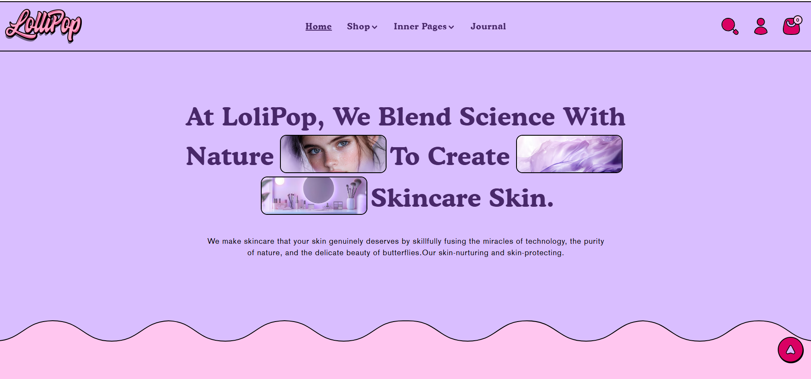
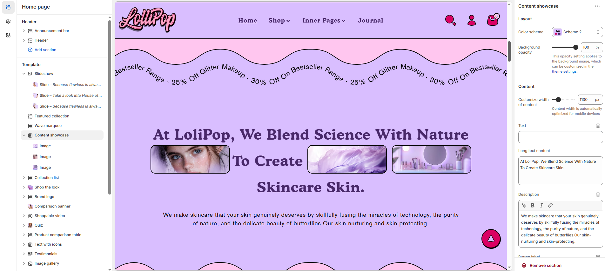
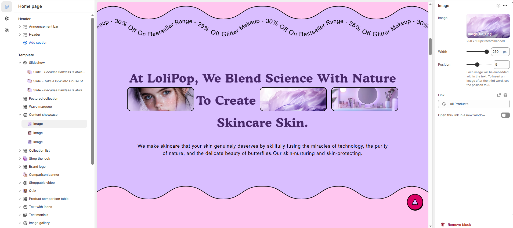

# Content showcase

The **Content Showcase Section** allows you to display featured or selected products in a visually appealing way. It is ideal for highlighting **specific collections, best-sellers, new arrivals, or seasonal promotions** to enhance customer engagement.

> **success:** 
1. **Navigate to** Shopify Admin > Online Store > Themes.
2. **Click** Customize on your active theme.
3. **In the Theme Editor**, click **Add Section > Content Showcase**.

<figure><figcaption></figcaption></figure>

### **Settings & Customization**

#### Layout

* **Color scheme:** You can customize the section’s appearance by changing the **text color, background color**, and more using **preset color** options.
* **Background Opacity** : Set the transparency level (Range: 0–100, Default: 100).\
  This setting applies to the background image, which can be customized in the theme settings.

<figure><figcaption></figcaption></figure>

#### **Content**

* **Customize Width of Content:** You can set the content width (e.g., 1130px). It is automatically optimized for mobile devices.
* **Text:** Set a custom title (e.g., "Heading").
* **Long Text Content:** Main content of the Content Showcase.
* **Description:** Customize the Content Showcase description.
* **Button Label:** Add text for the button (e.g., "Shop Now").
* **Button Link:** Set the URL destination.
* **Button Style:** Choose the button style (Primary, Secondary, or Hyperlink).
* **Desktop Content Alignment:** Choose the text alignment for desktops **(Left, Right, or Center).** The content is automatically centered on mobile screens.

#### Section padding

* **Top Padding:** Adjust spacing above the section.
* **Bottom Padding:** Adjust spacing below the section.

#### Section divider

* **Shapes** : Adds shape effects to the section. Options: **( Curve Top, Curve Bottom, Curve Both, None, Border Top, Border Bottom, and Both Border)**.

> **success:** 
click **Content Showcase  Section >  Add  Icon**

<figure><figcaption></figcaption></figure>

#### **Icon**

* **Image:** Upload a custom image or select from free images.
* **Image Width:** Set the image width (e.g., 250px).
* **Image Position:** Define the placement of the image within the text. (For example, setting the position to 3 places the image after the third word).
* **Link:** Assign a destination link (e.g., All Products).
* **Open Link in a New Window:** Enable this option to open the link in a new tab.
