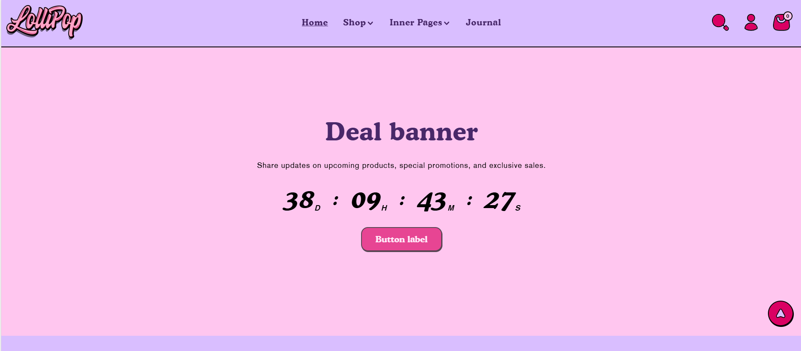
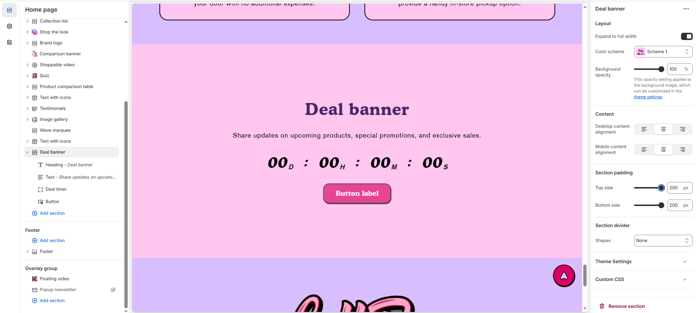

# Deal Banner

The **Deal Banner Section** allows you to create an eye-catching promotional banner with a countdown timer to highlight special deals, limited-time offers, or exclusive sales.

> **success:** 
1. **Go to** Shopify Admin > **Online Store > Themes**.
2. Click **Customize** on your active theme.
3. In the Theme Editor, click **Add Section > Deal Banner**.

<figure><figcaption></figcaption></figure>

### **Settings & Customization**

<figure><figcaption></figcaption></figure>

* **Expand to Full Width:** Enable this option to extend the section across the entire screen width.
* **Color scheme:** You can customize the section’s appearance by changing the **text color, background color**, and more using **preset color** options.
* **Background Opacity:** Set the transparency level (Range: **0–100**, Default: **100**). This applies to the background image, which can be customized in the theme settings.

#### **Content Settings**

* **Desktop Content Alignment:** Choose the desktop content alignment **Left, Right, or Center**.
* **Mobile Content Alignment:**  Choose the mobile content alignment **Left, Right, or Center**.

#### **Section Padding** 

* **Top Padding:** Adjust spacing above the section.
* **Bottom Padding:** Adjust spacing below the section.

#### Section divider

* **Shapes** : Adds shape effects to the section. Options: **( Curve Top, Curve Bottom, Curve Both, None, Border Top, Border Bottom, and Both Border)**.

### **Block Settings**

* **Heading :**&#x20;
  * **Heading:** Set a custom title (e.g., "Deal banner" ).
  * **Heading Size:** Choose from **Small, Medium, or Large** (Default: **Large**).
* **Text:** Provide a short description.
* **Select Date:** Choose the deal’s end date (**Format: 29-09-2025**).
* **Button Settings**
  * **Button Label:** Customize the button text (**e.g., "Shop Now"**).
  * **Button Link:** Paste or search for a destination URL.
  * **Button Style:** Enable to display the button with an outlined border instead of a filled style.
  * **Open this link in a new window:** Enable to open the link in a new tab.
