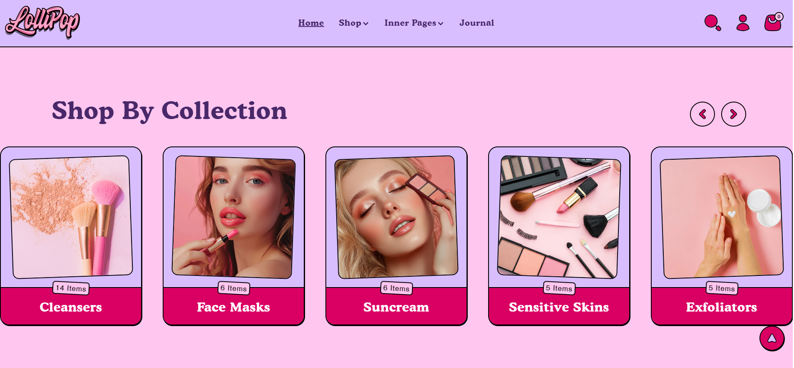
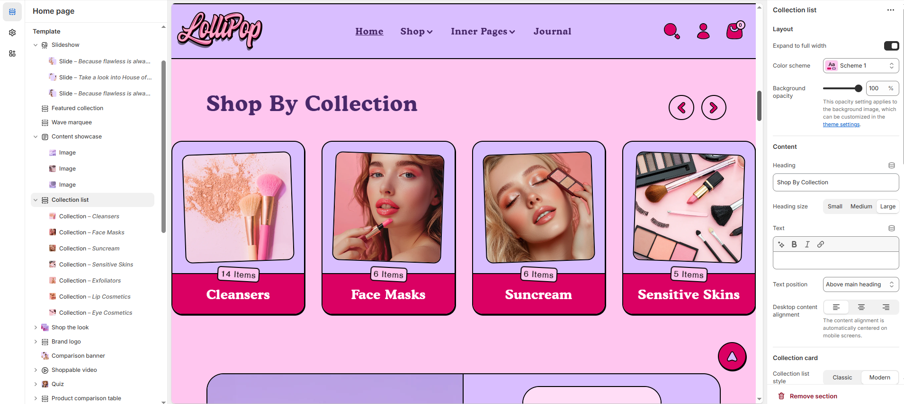
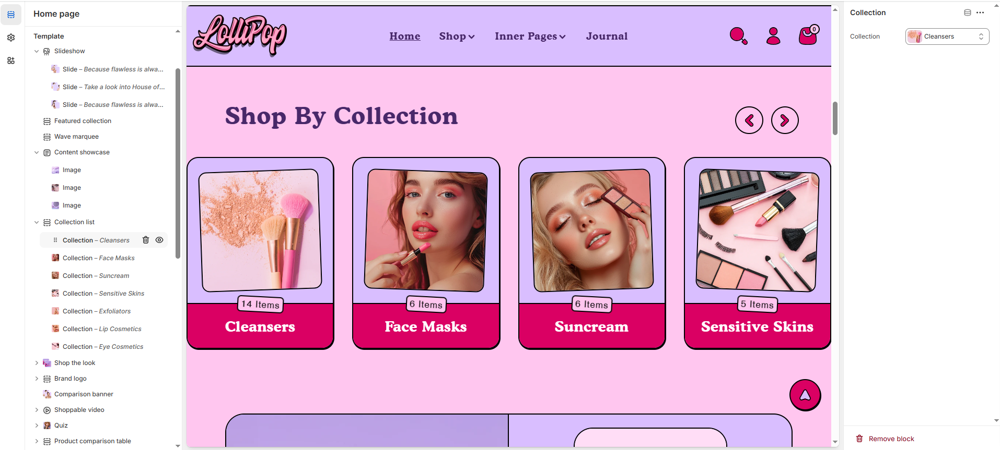

# Collection list

The **Collection List** section allows you to display a list of collections in a visually appealing way, making it easy for customers to explore various categories or product groups.

> **success:** 
1. **Go to** Shopify Admin > Online Store > Themes.
2. **Click** Customize on your live theme.
3. In the theme editor, **click** Add Section > **Collection list**.

<figure><figcaption></figcaption></figure>

### **Customize the** Collection list **Section**

<figure><figcaption></figcaption></figure>

#### **Layout**

* **Expand to Full Width** : Enable this option to extend the collection list across the entire screen width.
* **Color scheme:** You can customize the section’s appearance by changing the **text color, background color**, and more using **preset color** options.
* **Background Opacity** : Adjust transparency (Range: 0–100 %, Default: 100%). This applies to the background image, customizable in theme settings.

#### Content Settings

* **Heading:** Set a custom title (e.g., "Hot & Top Trends").
* **Heading Size:** Choose from **Small, Medium, or Large**.
* **Text :** Add additional text if needed.
* **Text Position :** Select the Position&#x20;
  * **Above Main Heading** : Position the subheading above the main heading.
  * **Below main heading :** Position the subheading below the main heading.
* **Desktop Content Alignment** : Choose the text alignment for desktop. **( Left, Right & Center ).** The content alignment is automatically centered on mobile screens.

#### **Collection Card Settings**

* **Collection List Style** : Choose how the collections are displayed: **Classic** and **Modern.**
* **Enable Collection Description** : Show a description for each collection.
* **Enable Collection Count** : Show the number of products in each collection.
* **Column Alignment** : Adjust how the collections are aligned in columns.
* **Aspect ratio :** There are 3 option image ratio as **( Adapt to image, square, and portrait)** Can choose the required style as theme requirement.

#### **Column Settings**

* **Desktop Columns** : Choose the number of columns for desktop view (Options: 3, 4, 5, 6).
* **Mobile Columns** : Choose the number of columns for mobile view (Options: 1, 2).

#### **Carousel Settings**

* **Enable Carousel** : Activate a sliding format for product display.
* **Change Slides Every** : Set transition delay (in seconds). If set to 0, auto-play is disabled.
* **Gap** : Define spacing between items (Default: 30px, auto-adjusts for mobile).
* **Pagination** : Choose the pagination type: **Dots** (dot indicators), **Arrow** (manual navigation), or **None** (no indicators).
* **Pagination Style** : Choose the style: **Classic** (traditional) or **Modern** (updated look).

#### Section padding

* **Top Padding :** Adjust spacing above the section.
* **Bottom Padding :** Adjust spacing below the section.

#### Section divider

* **Shapes** : Adds shape effects to the section. Options: **( Curve Top, Curve Bottom, Curve Both, None, Border Top, Border Bottom, and Both Border)**.

### Collection

<figure><figcaption></figcaption></figure>

* **Collection :** Select Collection

> **success:** 
[Steps to Create a Collection](https://help.shopify.com/en/manual/products/collections/manual-shopify-collection#create-a-manual-collection)

