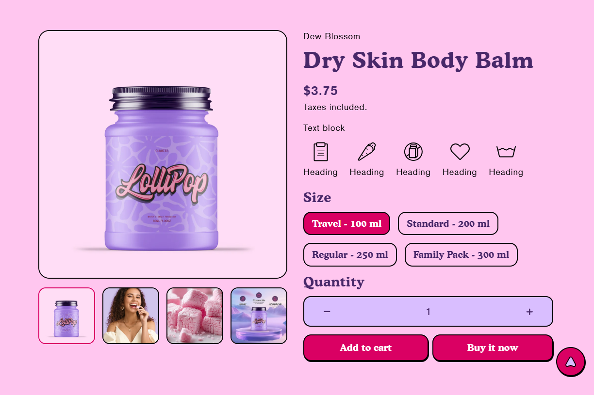

# Featured Products

The **Featured Products Section** allows you to highlight selected products on your homepage or other pages. This section is ideal for showcasing **best-sellers, new arrivals, or promotional items**, helping customers easily discover key products.

> **success:** 
1. **Go to** Shopify Admin > Online Store > Themes.
2. **Click** Customize on your active theme.
3. In the theme editor, **click** Add Section > Featured Products.

<figure><figcaption></figcaption></figure>

### **Settings & Customization**

<figure><figcaption></figcaption></figure>

**Color scheme :** You can customize the section’s appearance by changing the **text color, background color**, and more using preset color options.

**Select Product:** Choose the product to be featured.

#### **Layout Settings**

* **Expand to Full Width:** Enable this option to extend the section across the entire screen width.
* **Enable Sticky on Desktop:** Keep the product section fixed while scrolling.
* **Media Width:** Choose from **Small, Medium, or Large**.
* **Media Position:** Set image placement to **Left or Right**.
* **Thumbnail Layout:** Choose **Horizontal, Stacked or Vertical** arrangement.
* **Zoom Options:**
  * **Inner Zoom :** Enables zoom effect on hover.
  * **Photoswipe Lightbox :** Opens the image in a lightbox.
  * **None :** Disables zoom functionality.
* **Mobile Layout :** Enable to remove thumbnails for a cleaner mobile experience.
* **Navigation Style:** Select **Classic** or **Modern** for the navigation UI.

#### **Section Padding** 

* **Top Padding:** Adjust spacing above the section.
* **Bottom Padding:** Adjust spacing below the section.

#### Section divider

* **Shapes** : Adds shape effects to the section. Options: **( Curve Top, Curve Bottom, Curve Both, None, Border Top, Border Bottom, and Both Border)**.

### **Block Settings**

* **Vendor :** Displays the vendor. There are no customization block settings available for this..&#x20;
* **Title :** Displays the product’s title. There are no customization block settings available for this.
* **Price :** Displays the price. There are no customization block settings available for this.
* **Text Block : Enter additional text to display.**&#x54;o display dynamic data like product Title or Vendor, select the Insert dynamic source icon shown next to the Text box and select any metafield to add there.
* **Icon with text :** Icon 1-4 **Icon.**&#x20;
  * **Custom icon** Choose any icon from the list.
  * **Heading** Enter the heading text.
  * **Custom image** Add the image of the icon.
* **Varient Selector :** This is to show the product variants, e.g., Size, colors, etc.
  * **Option style :** Choose the **Dropdown** and  **button style**.
  * **Enable Color swatches** : Enable or disable the color swatches.
  * **Swatch Shapes :** Choose the **Rounded** and  **Boxed** style.&#x20;
  * **Show Varient image as Swatches :** Enable or disable the show varient images.
* **Quantity :** This block shows the quantity selector.
* **Buy Button :** This block is to show the **Add to cart** button along with below settings:&#x20;
  * **Show dynamic checkout button** Select the checkbox to show the dynamic checkout button.
  * **Show recipient information form for gift cards** Select the checkbox to show the recipient information form for gift cards only.
* **Sku :** It highlights the product’s SKU.
* **Share :** This block will show the share.
* **Description :** Displays the product description on the page. There are customization block settings available for this.
* **Custom Liquid :** You can add custom liquid codes for advanced customization, like app snippets.
* **Modal text :** This block will show the popup modal.
