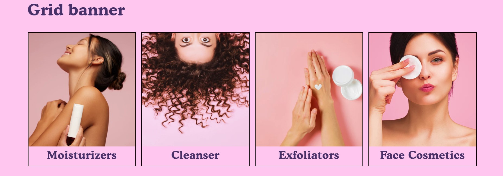
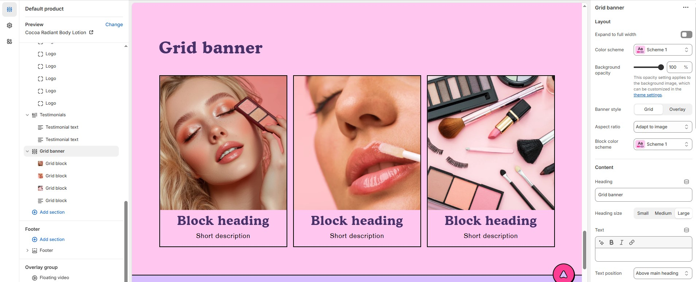
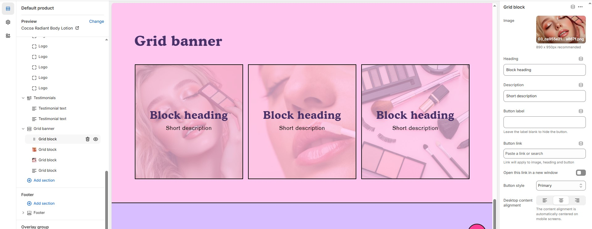

# Grid Banner

The **Grid Banner Section** allows you to create a **grid layout** of cards featuring **background images, and text**. This section is useful for highlighting **categories, promotions, or featured content** in an engaging and structured format.

> **success:** 
1. **Go to** Shopify Admin > **Online Store > Themes**.
2. Click **Customize** on your active theme.
3. In the Theme Editor, click **Add Section >  Grid Banner**&#x20;

<figure><figcaption></figcaption></figure>

### **Settings & Customization**

<figure><figcaption></figcaption></figure>

#### **Layout** 

* **Expand to Full Width:** Enable this option to extend the section across the entire screen width.
* **Color scheme:** You can customize the section’s appearance by changing the **text color, background color**, and more using **preset color** options.
* **Background Opacity:** Set the transparency level (Range: 0–100, Default: 100). This applies to the background image, which can be customized in the theme settings.
* **Banner Style**: Choose between **Grid or Overlay**
* **Aspect Ratio:** Choose how the image scales **Square, Portrait, or Adapt to image** .
* **Block color scheme :** You can customize the section’s appearance by changing the **text color, background color**, and more using **preset color** options.

#### **Content Settings**

* **Heading:** Set a custom title (e.g., "Collection List with Banner")
* **Heading Size:** Choose from Small, Medium, or Large (Default: Large).
* **Text:** Add optional supporting text.
* **Text Position:**
  * **Above Main Heading** : Position the subheading above the main heading.
  * **Below Main Heading :** Position the subheading below the main heading.
* **Desktop Content Alignment:** Set text alignment for desktop **(Left, Center, or Right)**.

#### **Column Settings**

* **Desktop Columns :** Choose the number of columns for desktop view. (Options: 3, 4, and 5)
* **Mobile Columns :** Choose the number of columns for mobile view. (Options: 1, 2)

#### **Carousel Settings** 

* **Enable Carousel** : Enable to display products in a sliding carousel format.
* **Change Slides Every**: Set transition delay (in seconds). If set to 0, auto-play is disabled.
* **Gap** : Define spacing between items (Default: 30px, auto-adjusts for mobile).
* **Pagination** : Choose the pagination type: **Dots** (dot indicators), **Arrow** (manual navigation), or **None** (no indicators).
* **Pagination Style** : Choose the style: **Classic** (traditional) or **Modern** (updated look).

#### Section padding 

* **Top Padding:** Adjust spacing above the section.
* **Bottom Padding:** Adjust spacing below the section.

#### Section divider

* **Shapes** : Adds shape effects to the section. Options: **( Curve Top, Curve Bottom, Curve Both, None, Border Top, Border Bottom, and Both Border)**.

<figure><figcaption></figcaption></figure>

### **Grid Block Settings**

* **Image**: Upload an image (890 x 950px recommended).
* **Heading**: Enter the block heading (e.g., "Block Heading").
* **Description**: Add a short description.
* **Button Label**: Customize the button text (e.g., "Shop Now" or "View Collection").
* **Button Link**: Paste a URL or use the search bar to link the button to a relevant page.
* **Open Link in a New Window**: Enable to open the link in a new tab.
* **Button Style**: Choose the button style (Primary, Secondary, or Hyperlink).
* **Desktop Content Alignment:** Set text alignment for desktop **(Left, Center, or Right)** automatically centered on mobile screens.
