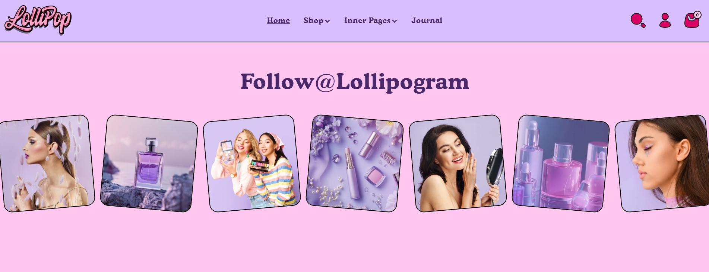
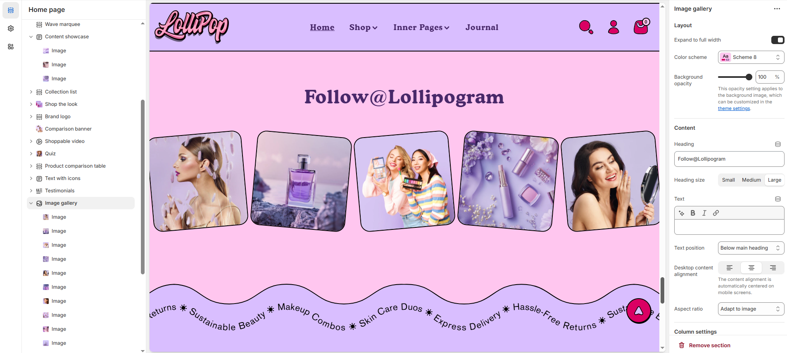
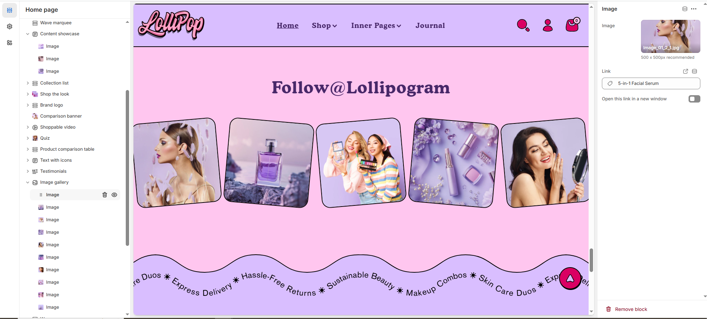

# Image gallery

The **Image Gallery Section** allows you to display multiple images in a visually appealing layout. It is ideal for showcasing **product images, brand visuals, promotions, or lifestyle photography** to enhance customer engagement.

> **success:** 
1. **Navigate to** Shopify Admin > Online Store > Themes.
2. **Click** Customize on your active theme.
3. **In the Theme Editor**, click **Add Section > Image Gallery**.

<figure><figcaption></figcaption></figure>

### Settings & Customization

<figure><figcaption></figcaption></figure>

#### **Layout**

* **Expand to Full Width** : Enable this option to extend the image gallery across the entire screen width.
* **Color scheme:** You can customize the section’s appearance by changing the **text color, background color**, and more using **preset color** options.
* **Background Opacity** : Adjust transparency (Range: 0–100 %, Default: 100%). This applies to the background image, customizable in theme settings.

#### Content Settings

* **Heading:** Set a custom title (e.g., "Hot & Top Trends").
* **Heading Size:** Choose from **Small, Medium, or Large**.
* **Text :** Add additional text if needed.
* **Text Position :** Select the Position&#x20;
  * **Above Main Heading** – Position the subheading above the main heading.
  * **Below main heading** – Position the subheading below the main heading.
* **Desktop Content Alignment** – Choose the text alignment for desktop. **( Left, Right & Center ).** The content alignment is automatically centered on mobile screens.
* **Aspect ratio -** There are 3 option image ratio as **( Adapt to image, square and portrait) c**an choose the required style as theme requirement.
* **Gallery View :** Selct the gallery style
  * **Rotate** – Enables rotating images within the gallery (This option works only when the carousel is enabled).
  * **Default** – Displays images in a standard gallery format.

#### **Column Settings**

* **Desktop Columns** – Choose the number of columns for desktop view (Options: 5,6,7).
* **Mobile Columns** – Choose the number of columns for mobile view (Options: 1, 2).

#### **Carousel Settings** 

* **Enable Carousel** : Activate a sliding format for product display.
* **Change Slides Every:** Set transition delay (in seconds). If set to 0, auto-play is disabled.
* **Gap** : Define spacing between items (Default: 30px, auto-adjusts for mobile).
* **Pagination** : Choose the pagination type: **Dots** (dot indicators), **Arrow** (manual navigation), or **None** (no indicators).
* **Pagination Style** : Choose the style: **Classic** (traditional) or **Modern** (updated look)..

#### Section padding

* **Top Padding :** Adjust spacing above the section.
* **Bottom Padding :** Adjust spacing below the section.

#### Section divider

* **Shapes** : Adds shape effects to the section. Options: **( Curve Top, Curve Bottom, Curve Both, None, Border Top, Border Bottom, and Both Border)**.

> **success:** 
**In the Theme Editor**, click **Add Section > Image Gallery >** add **Image**

<figure><figcaption></figcaption></figure>

### Image

* **Image:** Upload a custom image or select from free images.
* **Link:** Assign a destination link (e.g., All Products).
* **Open Link in a New Window:** Enable this option to open the link in a new tab.
