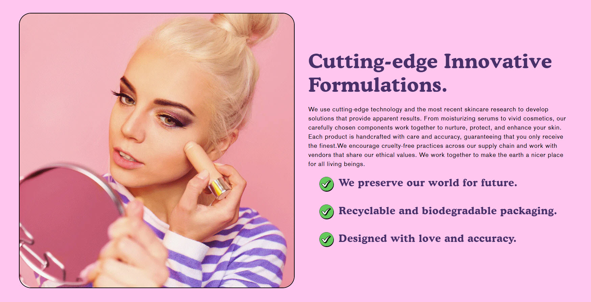

# Image with Text

The **Image with Text** section allows you to display an image alongside text, creating a visually appealing layout that enhances storytelling, promotions, or brand messaging.

> **success:** 
1. **Go to** Shopify Admin > **Online Store > Themes**.
2. Click **Customize** on your active theme.
3. In the Theme Editor, click **Add Section > Image with Text**.

<figure><figcaption></figcaption></figure>

### **Settings & Customization**

<figure><figcaption></figcaption></figure>

#### **Layout Settings**

* **Expand to Full Width:** Enable this option to stretch the section across the entire screen width.
* **Color scheme :** You can customize the section’s appearance by changing the **text color, background color**, and more using preset color options.
* **Background Opacity:** Adjust the transparency level (Range: 0–100, Default: 100). This setting applies to the background image, which can be customized in the theme settings.

#### **Image Settings**

* **Upload Image:** Select an image or explore free images.
* **Desktop image width :** Choose from **Small, Medium, or Large.** Image width is automatically optimized for mobile.
* **Banner Height:** Set the banner height to **Adapt, Small, Medium, or Large**.
* **Image Placement:** Choose **Image First** or **Image** **Last** . Image First is the default mobile layout.

#### **Content Alignment**

* **Desktop Content Alignment:** Set text alignment for Desktop alignment **(Left, Center, or Right).**
* **Mobile Content Alignment:** Set text alignment for Mobile Alignment **(Left, Center, or Right).**

#### **Section Padding**

* **Top Padding:** Adjust the spacing above the section.
* **Bottom Padding:** Adjust the spacing below the section.

#### Section divider

* **Shapes** : Adds shape effects to the section. Options: **( Curve Top, Curve Bottom, Curve Both, None, Border Top, Border Bottom, and Both Border)**.

### Block Settings

* **Caption :** Customize the caption text.
* **Heading :**
  * **Heading**  Set a custom title.
  * Choose from **Small, Medium, or Large.**
* **Text :**  Add a brief text description to provide additional details about the image feature.
* **Bullet Points :** Add the bullet points in addition details about the sections.

