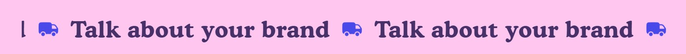
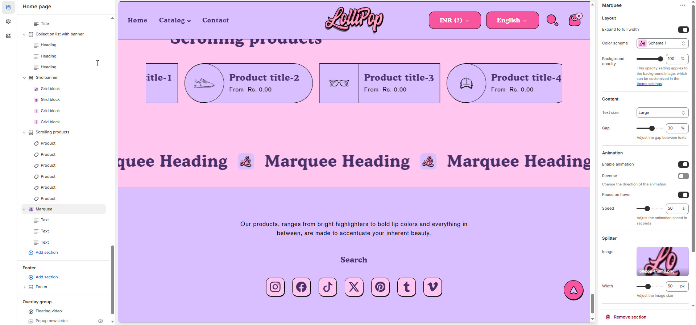

# Marquee

The **Marquee Section** allows you to display scrolling text across your store, making it ideal for **announcements, promotions, or highlighting key messages** in a dynamic way.


1. **Go to** Shopify Admin > **Online Store > Themes**.
2. Click **Customize** on your active theme.
3. In the Theme Editor, click **Add Section > Marquee**.


<figure><figcaption></figcaption></figure>

### **Settings & Customization**

<figure><figcaption></figcaption></figure>

#### **Layout** 

* **Expand to Full Width:** Enable this option to extend the section across the entire screen width.
* **Color scheme:** You can customize the section’s appearance by changing the **text color, background color**, and more using **preset color** options.
* **Background Opacity:** Adjust transparency (Range: 0–100 %, Default: 100%). This applies to the background image, customizable in theme settings.

#### **Content Settings**

* **Text Size** : Choose from **Small, Medium, or Large**.
* **Gap** : Define spacing between items (Default: 30px, auto-adjusts for mobile).

#### **Animation Settings**

* **Enable Animation** : Activate animation for a dynamic scrolling effect.
* **Reverse Animation** : Change the direction of the animation.
* **Pause on Hover** : Stop the animation when users hover over the text.
* **Animation Speed** : Adjust the scrolling speed (eg., 50).

#### **Splitter Image Settings**

* **Upload Image** : Add a separator image between repeating texts.
* **Width** : Adjust the image size (eg., 50).

#### Section padding 

* **Top Padding :** Adjust spacing above the section.
* **Bottom Padding :** Adjust spacing below the section.

#### **Text Marquee Settings**

* **Text:** Enter the text to be displayed in the marquee.

