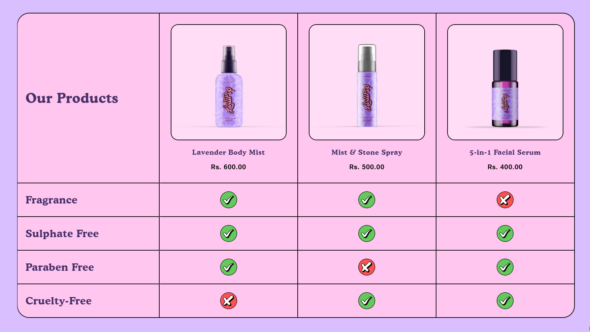
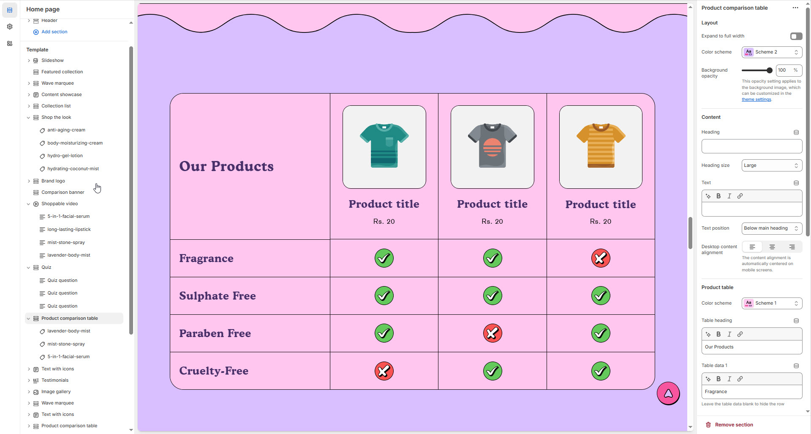
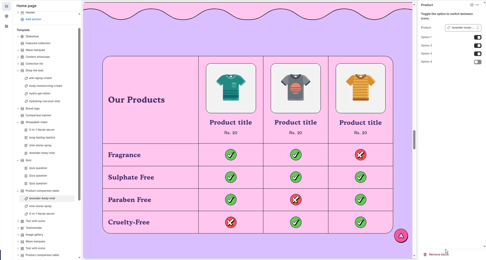

# Product Comparison Table

A **Product Comparison Table** allows customers to compare similar products based on key attributes. This feature is especially useful for stores selling products with various options or tiers (e.g., different versions of a product or subscription plans).


1. **Go to Shopify Admin** > Online Store > Themes.
2. Click **Customize** on your active theme.
3. In the theme editor, click **Add Section** > **Product Comparison Table**
4. Create a comparison table by adding key product attributes (like size, price, features, etc.) for each product in a **structured table layout**.
   * Example columns: Product Name, Price, Size, Features, Reviews, etc.


<figure><figcaption></figcaption></figure>

### **Settings & Customization**

<figure><figcaption></figcaption></figure>

#### **Layout**

* **Expand to Full Width:** Enable this option to extend the section across the entire screen width.
* **Color scheme:** You can customize the section’s appearance by changing the **text color, background color**, and more using **preset color** options.
* **Background Opacity:** Adjust transparency (Range: 0–100%, Default: 100%). This applies to the background image, customizable in theme settings.

#### **Content Settings**

* **Heading:** Set a custom title (e.g., "Compare Our Products").
* **Heading Size:** Choose from **Small, Medium, or Large.**
* **Text :** Add additional descriptive text if needed.
* **Text Position:** Choose placement relative to the heading:
  * **Above Main Heading** : Display subheading above the main heading.
  * **Below Main Heading** : Display subheading below the main heading.
* **Desktop Content Alignment:** Align content to **Left, Right, or Center** (automatically centered on mobile screens).

#### **Product Table Settings**

* **Color Scheme:** Choose a preset color scheme for the table.
* **Table Heading:** Set a title for the comparison table.

**Table Data** : Add or leave blank to hide specific rows:

* **Table Data 1** : Set compaction product data (e.g., Fragrance).
* **Table Data 2** : Set compaction product data (e.g., Sulphate-Free).
* **Table Data 3** : Set compaction product data (e.g., Paraben-Free).
* **Table Data 4** : Set compaction product data (e.g., Cruelty-Free).

#### **Section Padding**

* **Top Padding:** Adjust spacing above the section.
* **Bottom Padding:** Adjust spacing below the section.

#### Section divider

* **Shapes** : Adds shape effects to the section. Options: **( Curve Top, Curve Bottom, Curve Both, None, Border Top, Border Bottom, and Both Border)**.


&#x20;**Product Comparison Table > Add Product**


<figure><figcaption></figcaption></figure>

**Add Product**

* **Product:** Add your product to compare (e.g., lavender-body-mist)
* **Toggle Option:** Enable or disable icons for product display.

**Product Options&#x20;**_**(Enable/Disable each feature as needed)**_

* **Option 1:** Add your first product feature or specification (**Enable / Disable**)
* **Option 2:** Add your second product feature or specification (**Enable / Disable**)
* **Option 3:** Add your third product feature or specification (**Enable / Disable**)
* **Option 4:** Add your fourth product feature or specification (**Enable / Disable**)
