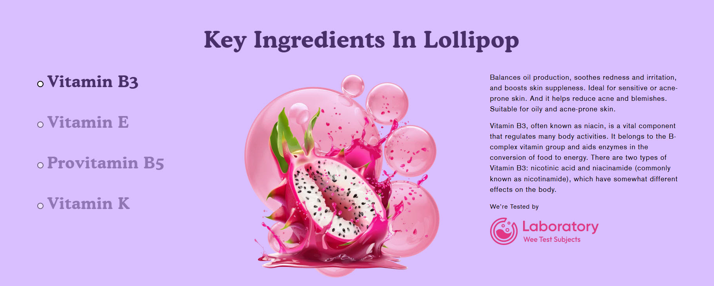
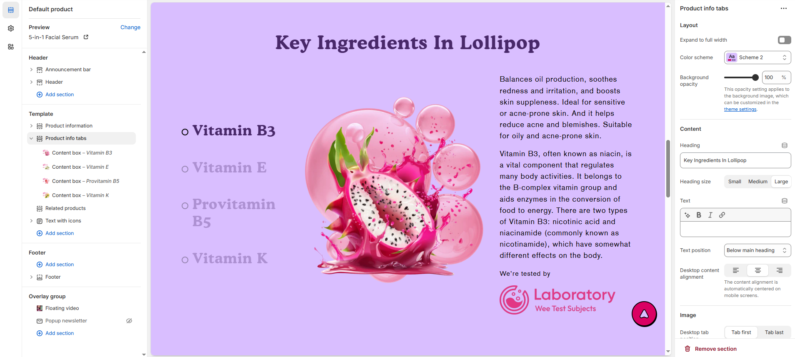
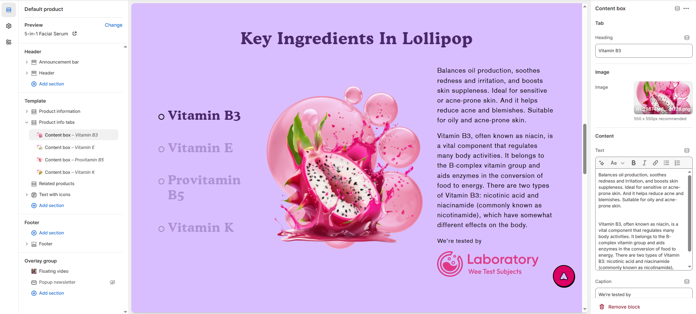

# Product info tabs

The **Product Info Tabs** feature helps organize detailed product information into collapsible or clickable tabs, making it easier for customers to browse key details without scrolling through long descriptions.

> **success:** 
1. **Go to Shopify Admin** > Online Store > Themes.
2. Click **Customize** on your active theme.
3. Select the **Product Page** from the theme editor.
4. Click **Add Section** > **Product Info Tabs**
5. Customize the tabs by adding relevant content like **Description, Shipping Info, Reviews, FAQs, or Size Charts**.

<figure><figcaption></figcaption></figure>

### **Settings & Customization**

<figure><figcaption></figcaption></figure>

#### **Layout Settings**

* **Expand to Full Width:** Enable this option to stretch the section across the entire screen width.
* **Color scheme :** You can customize the section’s appearance by changing the **text color, background color**, and more using preset color options.
* **Background Opacity:** Adjust transparency (Range: 0–100 %, Default: 100%). This applies to the background image, customizable in theme settings.

#### **Content**&#x20;

* **Heading:** Set a custom title (e.g., "Collection List with Banner")
* **Heading Size:** Choose from **Small, Medium, or Large**.
* **Text:** Add optional supporting text.
* **Text Position:**
  * **Above Main Heading** : Position the subheading above the main heading.
  * **Below Main Heading :** Position the subheading below the main heading.
* **Desktop Content Alignment:** Set text alignment for desktop **(Left, Center, or Right)**.

#### **Image**&#x20;

* **Desktop Tab Position**: Choose **Tab First** (tabs appear before the image) or **Tab Last** (tabs appear after the image). Tabs autoplay on mobile devices.
* **Desktop Image Placement:** Choose the options **Image First** and **Image second** (default for mobile layout).
* **Aspect ratio :** There are 3 option image ratio as **( Adapt to image, square, and portrait)** Can choose the required style as theme requirement.

#### **Section Padding** 

* **Top Padding:** Adjust spacing above the section.
* **Bottom Padding:** Adjust spacing below the section.

#### Section divider

* **Shapes** : Adds shape effects to the section. Options: **( Curve Top, Curve Bottom, Curve Both, None, Border Top, Border Bottom, and Both Border)**.

> **success:** 
**Product Info Tabs > Add Content Box**

<figure><figcaption></figcaption></figure>

### **Content Box Settings**

**Tab**

* **Heading:** Set a custom title for the tab (e.g., "Key Ingredients").

**Image**

* **Image :** Upload a custom image or select from free images.

**Content**

* **Text :** Provide details about the product, brand, or special announcements.
* **Caption:** Add a short, descriptive caption.
* **Icon :** Upload a custom image or select from free images.
* **Desktop Content Alignment:** Set text alignment for desktop **(Left, Center, or Right).**

