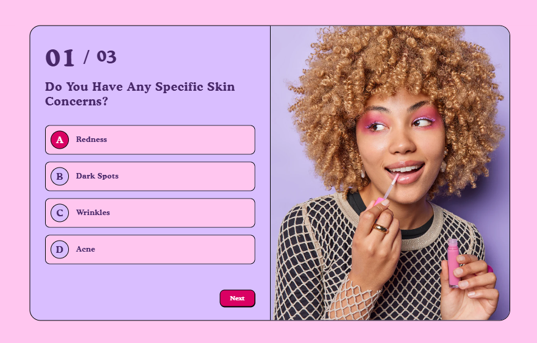
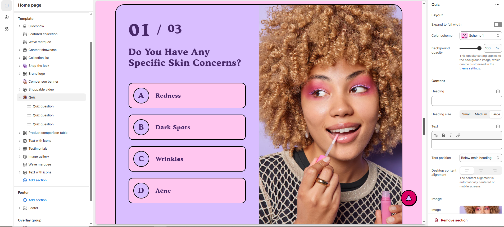
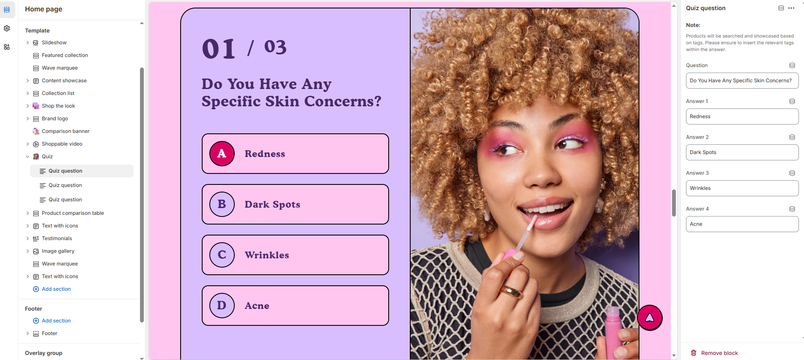

# Quiz Section

The **Quiz Section** is an interactive tool that allows customers to answer a series of questions to receive personalized product recommendations. Whether you are selling beauty products, clothing, or tech gadgets, a quiz can guide shoppers to the perfect product based on their preferences, needs, and styles.


1. **Go to Shopify Admin** > Online Store > Themes.
2. Click **Customize** on your active theme.
3. In the theme editor, click **Add Section** > **Quiz**&#x20;
4. Customize the quiz by adding **questions**, **answer options**, and **product recommendations** based on responses.


<figure><figcaption></figcaption></figure>

### **Settings & Customization** 

<figure><figcaption></figcaption></figure>

#### **Layout**

* **Expand to Full Width:** Enable this option to extend the section across the entire screen width.
* **Color scheme:** You can customize the section’s appearance by changing the **text color, background color**, and more using **preset color** options.
* **Background Opacity:** Set the transparency level (Range: 0–100, Default: 100).\
  This setting applies to the background image, which can be customized in the theme settings.

#### **Content**&#x20;

* **Heading:** Set a custom title (e.g., "Find Your Perfect Match!").
* **Heading Size:** Choose from **Small, Medium, or Large**.
* **Text :** Add additional descriptive text if needed.
* **Text Position:** Choose placement relative to the heading:
  * **Above Main Heading** : Display subheading above the main heading.
  * **Below Main Heading** : Display subheading below the main heading.
* **Desktop Content Alignment:** Align content to **Left, Right, or Center** (automatically centered on mobile screens).

#### **Image Settings**

* **Upload Image:** Add a visual for the quiz (Recommended : 1350 x 1430px recommended).
* **Image Placement:** Choose **Image First** and **Image Second** On mobile screens, the image will be used as the quiz question background.
* **Color Scheme:** Choose a preset color scheme for the blocks.

#### **Quiz Result Settings**

* **Result Heading:** Set a custom heading for the results sidebar (Default: "Recommended Products").

#### **Section Padding**

* **Top Padding :** Adjust spacing above the section.
* **Bottom Padding :** Adjust spacing below the section.

#### Section divider

* **Shapes** : Adds shape effects to the section. Options: **( Curve Top, Curve Bottom, Curve Both, None, Border Top, Border Bottom, and Both Border)**.

### **Quiz Section**

<figure><figcaption></figcaption></figure>

#### **Add Quiz Question**

* **Question:** Add your question here

**Answers & Product Matching**

* **Answer 1:** Add your choice of answer
* **Answer 2:** Add your choice of answer
* **Answer 3:** Add your choice of answer
* **Answer 4:** Add your choice of answer

**Tag-Based Product Matching**

* Products will be searched and showcased based on **tags**.
* Ensure that **relevant tags** are added to products so they appear in the quiz results.
