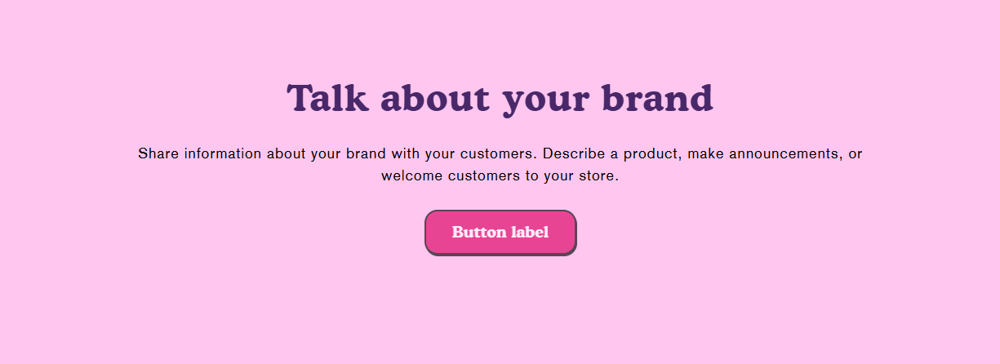
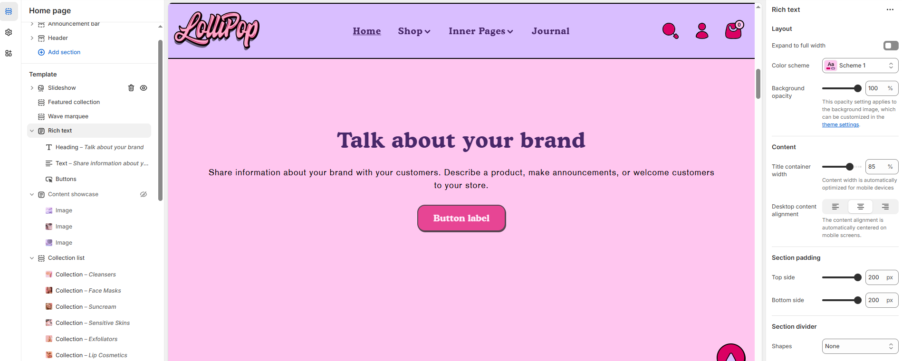

# Rich Text

The **Rich Text Section** allows you to add customizable text content to your store’s pages. It is ideal for displaying **announcements, brand messaging, promotional details, or any important information** in a structured format.


1. **Go to** Shopify Admin > Online Store > Themes.
2. **Click** Customize on your active theme.
3. In the theme editor, **click** Add Section > Rich Text.


<figure><figcaption></figcaption></figure>

### **Settings & Customization**

<figure><figcaption></figcaption></figure>

#### **Layout**

* **Expand to Full Width** : Enable this option to extend the rich text section across the entire screen width.
* **Color scheme:** You can customize the section’s appearance by changing the **text color, background color**, and more using **preset color** options.
* **Background Opacity** : Adjust transparency (Range: 0–100 %, Default: 100%). This applies to the background image, customizable in theme settings.

#### **Content Settings**

* **Title Container Width** :  Customize the width of the content container (e.g., 85%).\
  The content width is automatically optimized for mobile devices.
* **Desktop Content Alignment** : Choose the text alignment for desktop **( Left, Right & Center ).** The content alignment is automatically centered on mobile screens.

#### Section padding

* **Top Padding :** Adjust spacing above the section.
* **Bottom Padding :** Adjust spacing below the section.

#### Section divider

* **Shapes** : Adds shape effects to the section. Options: **( Curve Top, Curve Bottom, Curve Both, None, Border Top, Border Bottom, and Both Border)**.

### Rich text Block

#### **Heading**&#x20;

* **Heading :** Set a custom title (e.g., "Hot & Top Trends").
* **Heading Size:** Choose from heading size **(Small, Medium, or Large).**

#### **Subheading**

* **Subheading:** Add additional text if needed.

#### **Text**

* **Text :** Tell your brand's story through images.

**Buttons**

**First button**

* **Button label :** Customize the button text.
* **Button link :** Paste a URL or use the search bar to link the button to a relevant page.
* **Open this link in a new window :** Enable to open the link in a new tab.
* **Button style :** Choose the button style **(Primary, Secondary, or Hyperlink**_**).**_

**Second button**

* **Button label :** Customize the button text
* **Button link :** Paste a URL or use the search bar to link the button to a relevant page.
* **Open this link in a new window :** Enable to open the link in a new tab.
* **Button style :** Choose the button style **(Primary, Secondary, or Hyperlink**_**).**_

