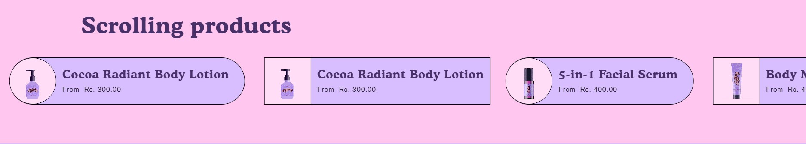
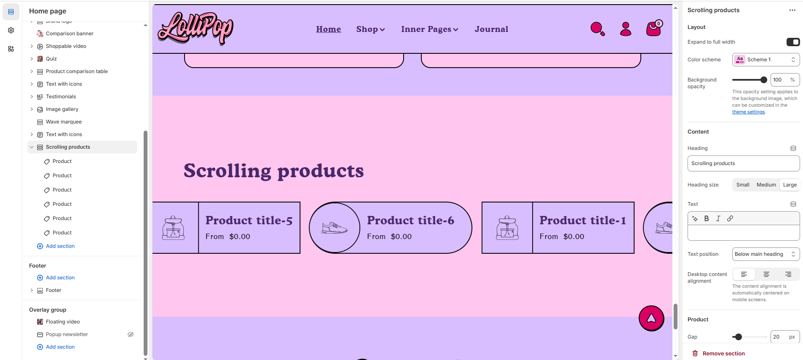

# Scrolling products

The **Scrolling Products** section enables customers to explore multiple products in a smooth, horizontal scrolling format. This feature enhances user engagement and makes browsing more convenient, especially on mobile devices.


1. **Go to Shopify Admin** > Online Store > Themes.
2. Click **Customize** on your active theme.
3. Click **Add Section** > **Scrolling Products**&#x20;


<figure><figcaption></figcaption></figure>

### **Settings & Customization**

<figure><figcaption></figcaption></figure>

#### **Layout** 

* **Expand to Full Width:** Enable this option to extend the section across the entire screen width.
* **Color scheme:** You can customize the section’s appearance by changing the **text color, background color**, and more using **preset color** options.
* **Background Opacity:** Set the transparency level (Range: 0–100, Default: 100). This applies to the background image, which can be customized in the theme settings.

#### Content  

* **Heading:** Set a custom title (**e.g., "Scrolling Products"**).
* **Heading Size:** Choose from **Small, Medium, or Large** (**Default: Medium**).
* **Text :** Add additional text if needed.
* **Text Position :** Select the Position
  * **Above Main Heading** : Position the subheading above the main heading.
  * **Below main heading :** Position the subheading below the main heading.
* **Desktop Content Alignment** : Choose the text alignment for desktop **Left, Right & Center .** The content alignment is automatically centered on mobile screens.

#### **Product**&#x20;

* **Gap Between Products:** Adjust spacing between products.&#x20;
* **Image Size:** Customize product image dimensions.
* **Desktop Alignment:** Choose the text alignment for desktop **Left, Right & Center .** The content alignment is automatically centered on mobile screens.

#### **Animation Settings**

* **Reverse Animation:** Adjust scrolling direction.
* **Speed:** Set scrolling speed.

#### Section padding 

* **Top Padding:** Adjust spacing above the section.
* **Bottom Padding:** Adjust spacing below the section.

#### Section divider

* **Shapes** : Adds shape effects to the section. Options: **( Curve Top, Curve Bottom, Curve Both, None, Border Top, Border Bottom, and Both Border)**.

### **Block Settings**

* **Color Scheme:**  You can customize the section’s appearance by changing the **text color, background color**, and more using **preset color** options..
* **Product:** Select a specific product to display.
* **Upload Image:** Choose a custom image for the product.

