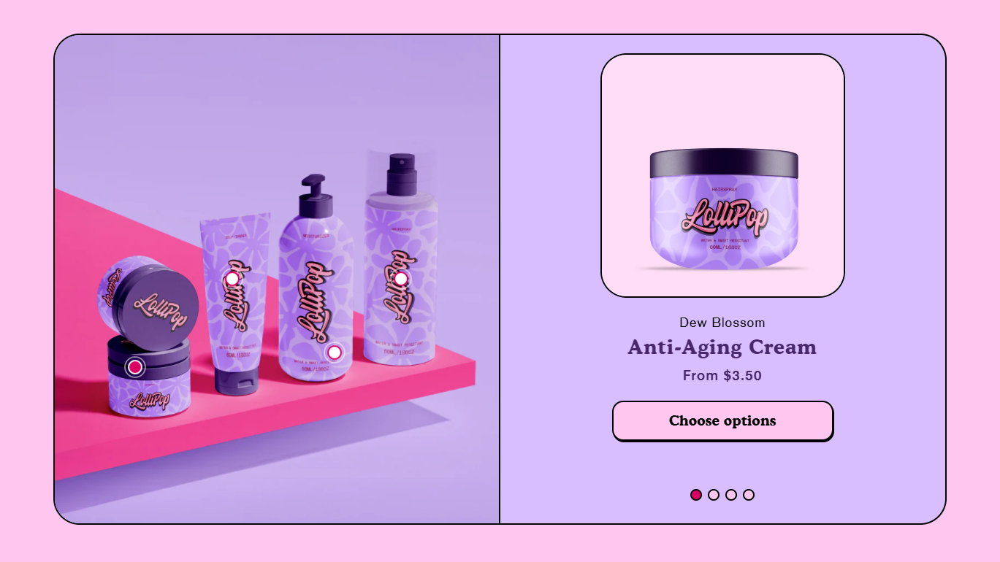
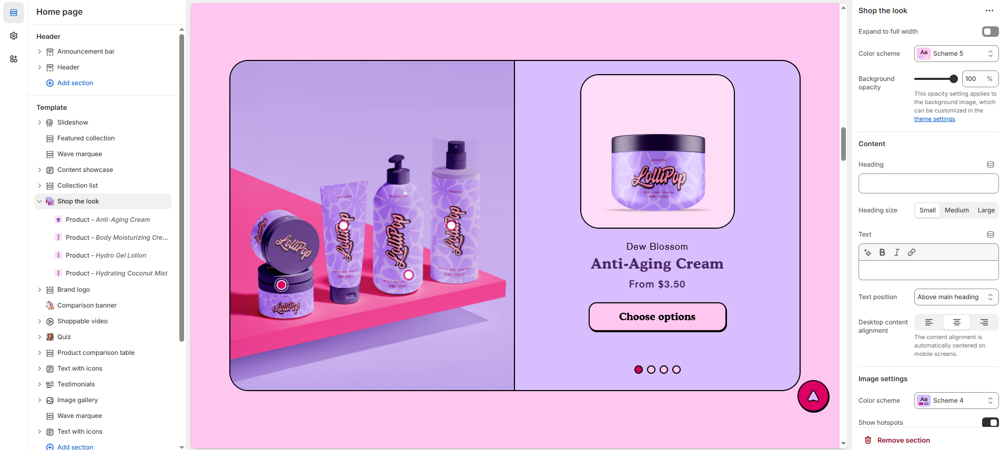
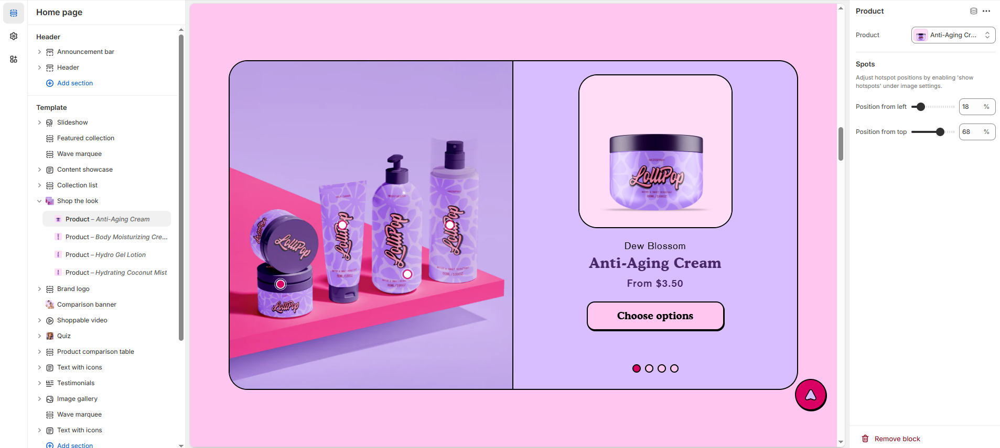

# Shop the look

The **Shop the Look** section allows you to showcase complete outfits or product sets, enabling customers to purchase multiple items directly from a single image. This feature enhances the shopping experience by providing a visually engaging and convenient way to explore curated product combinations.

> **success:** 
1. **Go to Shopify Admin** > Online Store > Themes.
2. Click **Customize** on your active theme.
3. In the theme editor, click **Add Section** > Shop the Look.
4. Customize the section by adding **products, images, and descriptions** to create an engaging shopping experience.

<figure><figcaption></figcaption></figure>

### **Settings & Customization**

<figure><figcaption></figcaption></figure>

#### **Layout**

* **Expand to Full Width:** Enable this option to extend the shop the look section across the entire screen width.
* **Color scheme:** You can customize the section’s appearance by changing the **text color, background color**, and more using **preset color** options.
* **Background Opacity:** Adjust transparency (Range: 0–100 %, Default: 100%). This applies to the background image, customizable in theme settings.

#### **Content**&#x20;

* **Heading:** Set a custom title (e.g., "Complete Your Look").
* **Heading Size:** Choose from **Small, Medium, or Large**.
* **Text :** Add additional descriptive text if needed.
* **Text Position:** Choose the placement of the subheading:
  * **Above Main Heading** : Position the subheading above the main heading.
  * **Below Main Heading** : Position the subheading below the main heading.
* **Desktop Content Alignment:** Align content to **Left, Right, or Center** (automatically centered on mobile screens).

#### **Image Settings**

* **Color Scheme:** Choose a preset color scheme for the image background.
* **Show Hotspots:** Enable product hotspots (visible only for in-stock products).
* **Desktop Image:** Upload a high-resolution image (Recommended size: 1340 x 1420px).
* **Mobile Image:** Upload a separate image optimized for mobile (Recommended size: 550 × 560px).
* **Desktop Image Placement:** Select the options **Image First** and **Image second** (default for mobile layout).

#### **Product Settings**

* **Aspect Ratio:** Select how product images appear **(Square, Portrait, or Adapt to Image)**.
* **Show Vendor:** Display the brand or vendor name under each product.
* **Show Secondary Image on Hover:** Enable to show an alternative image on hover.
* **Column Alignment:** Choose the column alignment **(** **Left, Right, or Center** **)**
* **Mobile content alignment :** Choose the mobile column alignment **( Left, Right, or Center ).**

#### **Carousel Settings**

* **Desktop Columns** : Choose the number of columns for desktop view. (Options: 1, 2)
* **Change Slides Every:** Set transition delay (in seconds). If set to 0, auto-play is disabled.
* **Gap:** Define spacing between items (Default: 30px, auto-adjusts for mobile).
* **Pagination** : Choose the pagination type: **Dots** (dot indicators), **Arrow** (manual navigation), or **None** (no indicators).
* **Pagination Style** : Choose the style: **Classic** (traditional) or **Modern** (updated look).

**Product card**

* **Show description :** Enable or disable the product description.
* **Show card swatch :** Enable or disable the product swatches.
* **Show quick add button :** Enable or disable quick add button.

#### **Section Padding**

* **Top Padding :** Adjust spacing above the section.
  &#x20;
* **Bottom Padding :** Adjust spacing below the section.

#### Section divider

* **Shapes** : Adds shape effects to the section. Options: **( Curve Top, Curve Bottom, Curve Both, None, Border Top, Border Bottom, and Both Border)**.

### **Shop the Look Section**

> **success:** 
In the theme editor, click **Add Section** > Shop the Look >  **Add Product**

<figure><figcaption></figcaption></figure>

**Add Product**

* **Product:** Select a product for display. ( Spots will only appear if the product is in stock. Sold-out items will not be added to the cart ).

**Hotspot Settings**

* **Position from Left:** Adjust the horizontal position of the hotspot (Default: **18 %**).
* **Position from Top:** Adjust the vertical position of the hotspot (Default: **68 %**).
