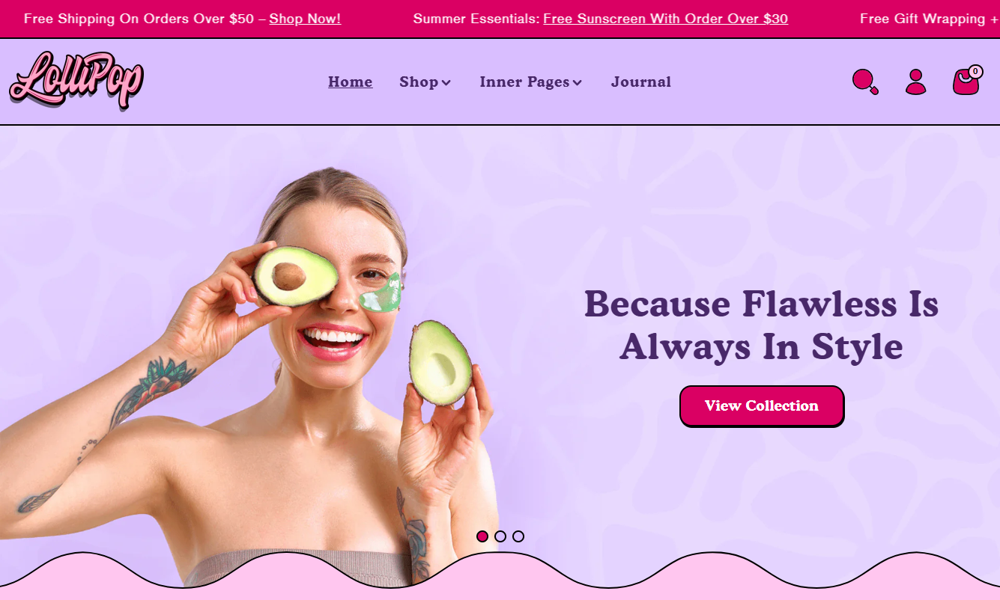
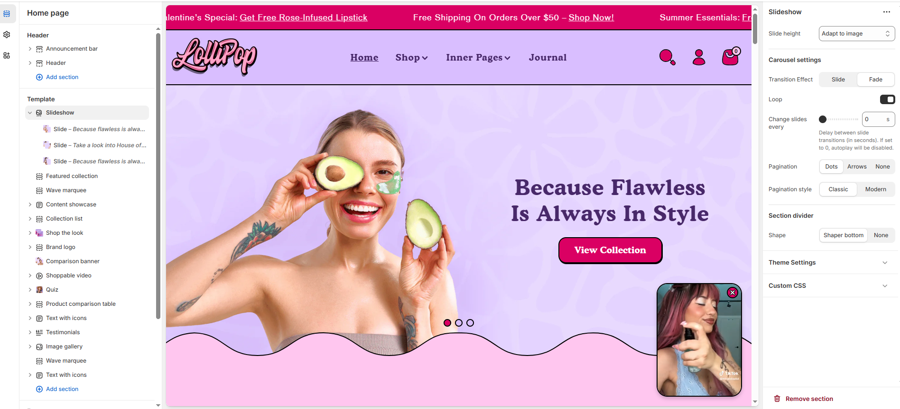
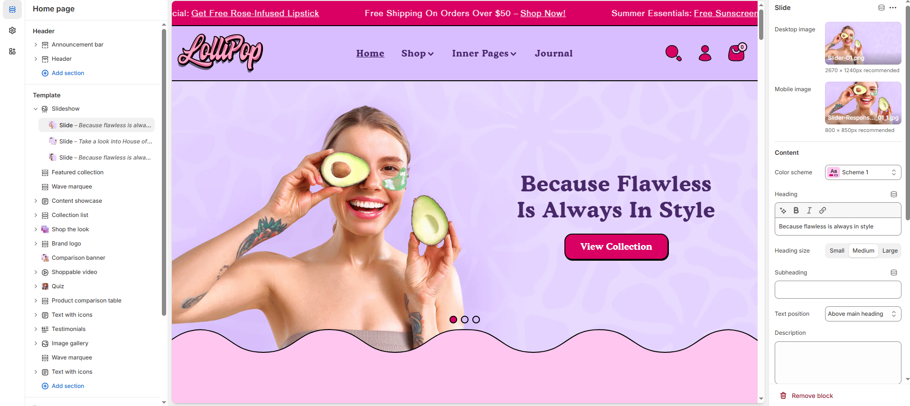

# Slideshow

The **Slideshow Section** is a dynamic content area that allows you to display multiple images or banners in a sliding format. It is perfect for highlighting promotions, featured products, or key messages.

> **success:** 
1. **Go to** Shopify Admin > Online Store > Themes.
2. **Click** Customize on your live theme.
3. In the theme editor, **click** Add Section > Slideshow.

<figure><figcaption></figcaption></figure>

### **Slideshow Section**

<figure><figcaption></figcaption></figure>

#### **Slideshow**

* **Slide Height :**  The slide height adjusts based on the uploaded image. Options : **Small, Medium, Large,** and **Adapt to Image**.

#### **Carousel Settings**

* **Effect**: Select the transition style between slides. **Options:** Slide – Traditional sliding animation.\
  Fade – Fades between slides for a smooth look.
* **Loop**:  Enable continuous looping of slides.
* **Change Slides Every**:  Set the delay (in seconds) between slide transitions.  Example: 0 disables autoplay.
* **Pagination** : Choose the pagination type: **Dots** (dot indicators), **Arrow** (manual navigation), or **None** (no indicators).
* **Pagination Style** : Choose the style: **Classic** (traditional) or **Modern** (updated look).

#### **Shapes**

* **Shapes** : Adds shape effects to the slideshow section. Options: **Curve Bottom and None.**

### **Slide Settings**

<figure><figcaption></figcaption></figure>

**Slide**

* **Desktop Image:** Upload an image for desktop view. Click **Select** to choose an image.
* **Mobile Image:** Upload a separate image optimized for mobile. Click **Select** to choose an image.
* **Color scheme:** You can customize the section’s appearance by changing the **text color, background color**, and more using **preset color** options.
* **Heading:** Add a heading for the slide (e.g., "Tell your brand's story through images").
* **Heading Size:** Choose from **Small, Medium, or Large** in the dropdown menu.
* **Subheading :** Add a short tagline above the main heading.
* **Text Position :** Select the Position&#x20;
  * **Above Main Heading** : Position the subheading above the main heading.
  * **Below Main Heading :** Position the subheading below the main heading.
* **Description :** Tell your brand's story through images.
* **Desktop Content Alignment** : Choose the text alignment for desktop **( Left, Right & Center ).**
* **Mobile Text Alignment** : Choose the text alignment for mobile **( Left, Right & Center ).**
* **Desktop Content Alignment :** Choose the Desktop content alignment for deskto&#x70;**( Top left, Top center, Top right, Middle left, Middle center, Middle right, Bottom left, Bottom center, Bottom right )** _Note:_ The position is automatically optimized for mobile and works only in the default style.
* **Text Background Opacity :** Set the background transparency behind the text. Range: 0 (transparent) – 100 (opacity).

#### **Button Settings**

* **Button Label:** Customize the button text (e.g., "Shop Now").
* **Button Link:** Paste a URL or use the search bar to link the button to a relevant page.
* **Button Style :** Choose the button style **(Primary, Secondary, or Hyperlink).**
* **Open in New Window** : Enable to open the link in a new tab.
