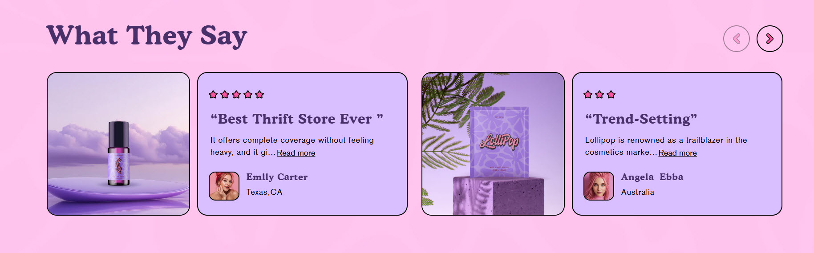
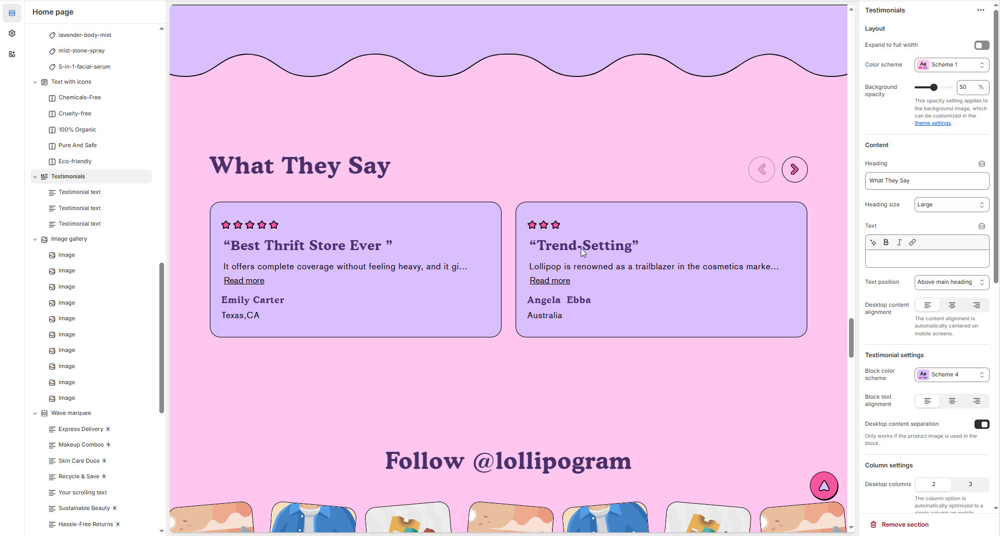
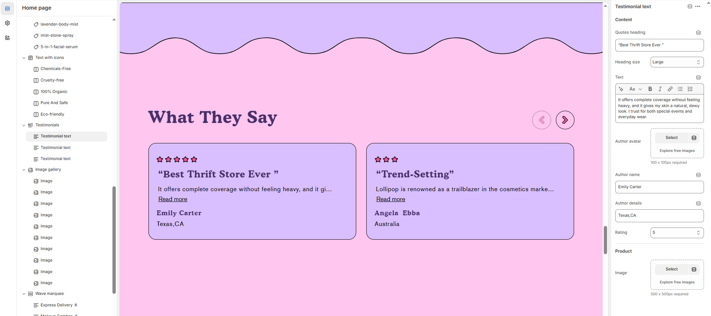

# Testimonials

The **Testimonials Section** allows you to showcase customer reviews, feedback, or endorsements, building trust and credibility with potential buyers.

> **success:** 
1. **Go to** Shopify Admin > **Online Store > Themes**.
2. Click **Customize** on your active theme.
3. In the Theme Editor, click **Add Section > Testimonials**.

<figure><figcaption>
<strong>Testimonials</strong>
</figcaption></figure>

### **Settings & Customization**

<figure><figcaption></figcaption></figure>

#### **Layout** 

* **Expand to Full Width:** Enable this option to extend the section across the entire screen width.
* **Color scheme:** You can customize the section’s appearance by changing the **text color, background color**, and more using **preset color** options.
* **Background Opacity:** Set the transparency level (Range: 0–100, Default: 100). This applies to the background image, which can be customized in the theme settings.

#### **Content Settings**

* **Heading:** Set a custom title (e.g., _"_&#x57;e’re are featured b&#x79;_"_).
* **Heading Size:** Choose from **Small, Medium, or Large**.
* **Text:** Add optional supporting text.
* **Text Position:**
  * **Above Main Heading** : Position the text above the heading.
  * **Below Main Heading** : Position the text below the heading.
* **Desktop Content Alignment:** Choose from **Left, Right, or Center** (Automatically centered on mobile screens).

#### Testimonial settings

* **Block color scheme :** Choose a preset color scheme for the blocks.
* **Block text alignment :** Choose from **Left, Right, or Center** (Automatically centered on mobile screens).
* **Desktop Content Separation** : You can Enable or Disable this option. (Works only if the product image is used in the block)

#### **Column Settings**

* **Desktop Columns** : Choose the number of columns for desktop view. (Options: 2 or 3) The column option is automatically optimized to a single column on mobile screens.

#### **Carousel Settings** 

* **Enable Carousel**: Toggle to display content in a sliding format.
* **Change Slides Every**: Set slide transition delay (in seconds). 0 disables auto-play.
* **Gap :** Define spacing between items (Default: 30px, auto-adjusts for mobile).
* **Pagination**: Choose the pagination type: **Dots** (dot indicators), **Arrow** (manual navigation), or **None** (no indicators).
* **Pagination Style**: Choose the style: **Classic** (traditional) or **Modern** (updated look).

#### Section padding 

* **Top Padding :** Adjust spacing above the section.
* **Bottom Padding :** Adjust spacing below the section.

#### Section divider

* **Shapes** : Adds shape effects to the section. Options: **( Curve Top, Curve Bottom, Curve Both, None, Border Top, Border Bottom, and Both Border)**.

<figure><figcaption></figcaption></figure>

### **Testimonial Settings**

* **Quotes Heading**: Enter the testimonial content (e.g., "Best Thrift Store Ever").
* **Heading Size**: Choose from **Small, Medium, or Large**.
* **Text**: Add a short description (e.g., "Use this text to share the information which you like!").
* **Author Avatar**: Upload an image (100x100px recommended).
* **Author Name**: Enter the author’s name (e.g., "Dominic Gibson").
* **Author Details**: Specify the author’s role or profession (e.g., "Artist").
* **Rating**: Specify the author’s review (e.g., 5 ⭐⭐⭐⭐⭐).
* **Product Image**: Upload an image (550x550px recommended)**.**

