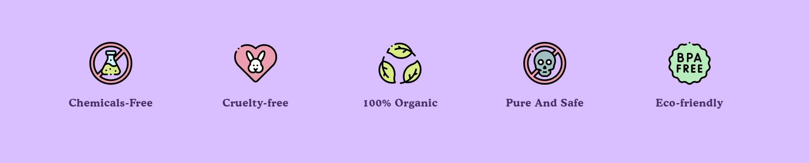
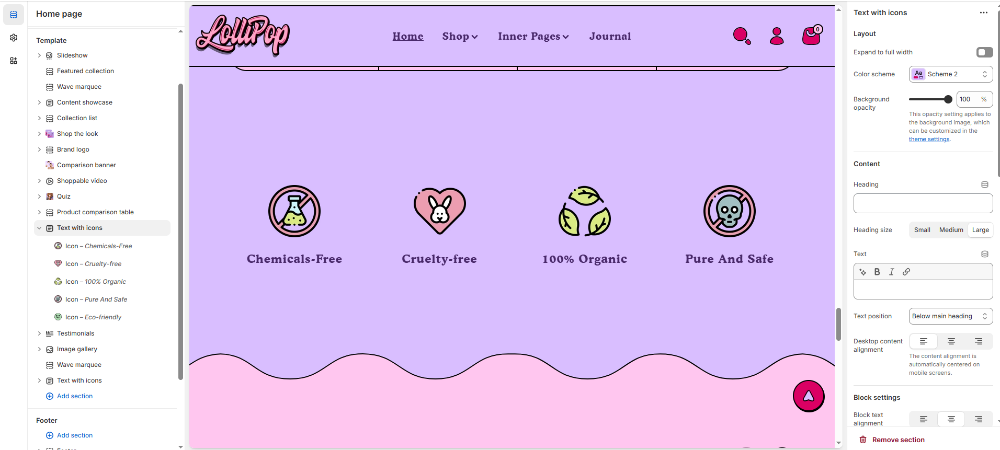

# Text with Icons

The **Text with Icons** section allows you to display important information using visual icons alongside text. This is ideal for highlighting **product features, benefits, shipping policies, guarantees**, or any key details in a structured and attractive format.

> **success:** 
1. **Go to Shopify Admin** > Online Store > Themes.
2. Click **Customize** on your active theme.
3. In the theme editor, click **Add Section** > **Text with Icons**.
4. Customize the section by:
   * Selecting **icons** (e.g., shipping, support, warranty).
   * Adding **headings & descriptions**.
   * Adjusting **layout and colors** to match your store’s branding.

<figure><figcaption></figcaption></figure>

### **Settings & Customization**

<figure><figcaption></figcaption></figure>

#### **Layout**

* **Expand to Full Width:** Enable this option to extend the section across the entire screen width.
* **Color scheme:** You can customize the section’s appearance by changing the **text color, background color**, and more using **preset color** options.
* **Background Opacity:** Adjust transparency (Range: 0–100 %, Default: 100%). This applies to the background image, customizable in theme settings.

#### **Content Settings**

* **Heading:** Set a custom title (e.g., "Our Features").
* **Heading Size:** Choose from **Small, Medium, or Large**.
* **Text :** Add additional text if needed.
* **Text Position:** Select the position:
  * **Above Main Heading :** Position the subheading above the main heading.
  * **Below Main Heading :** Position the subheading below the main heading.
* **Desktop Content Alignment:** Choose the text alignment for desktop **(Left, Center, or Right).**\
  The content alignment is automatically centered on mobile screens.

#### **Block Settings**

* **Block Text Alignment:** Choose the block text alignment **Left, Center, or Right.**
* **Color Scheme:** Choose a preset color scheme for the blocks.
* **Enable column background :** Enable or disable the column background.
* **Enable icon background :**  Enable or disable the icon background.
* **Border Style:** Apply a border effect to the block **(Options: None, Full border, Vertical border)**.

#### **Icon Settings**

* **Icon Position**: Choose between **Above Text** (icon displayed above the text) or **Default** (standard inline position).&#x20;
* **Icon Style**: Select Rotate to animate the **icon** or **Default** for a static appearance.
* **Image Width:** Customize the icon size (eg., 100px).

#### **Column Settings**

* **Desktop Columns:** Choose the number of columns for desktop view. (Options: 3, 4, 5)

#### **Carousel Settings**

* **Enable Carousel:** Activate a sliding format for product display.
* **Change Slides Every:** Set the transition delay (in seconds). If set to 0, auto-play will be disabled.
* **Gap:** Define spacing between items (Default: 30px, auto-adjusts for mobile)
* **Pagination** – Choose the pagination type: **Dots** (dot indicators), **Arrow** (manual navigation), or **None** (no indicators).
* **Pagination Style** – Choose the style: **Classic** (traditional) or **Modern** (updated look).

#### **Section Padding**

* **Top Padding :** Adjust spacing above the section.
  &#x20;
* **Bottom Padding :** Adjust spacing below the section.

#### Section divider

* **Shapes** : Adds shape effects to the section. Options: **( Curve Top, Curve Bottom, Curve Both, None, Border Top, Border Bottom, and Both Border)**.

<figure><figcaption></figcaption></figure>

> **success:** 
#### **Text with Icons > Add Text with Icons**

**Image Settings**

* **Upload Image:** Choose an image for the icon representation.(Select from your device or explore free images).
* **SVG Icons:** Upload an SVG icon for better scalability and performance.

**Content Settings**

* **Heading:** Set a custom title (e.g., "Chemicals-Free").
* **Heading Size:** Choose from **Small, Medium, or Large.**
* **Description:** Add a brief text description to provide additional details about the icon feature.
