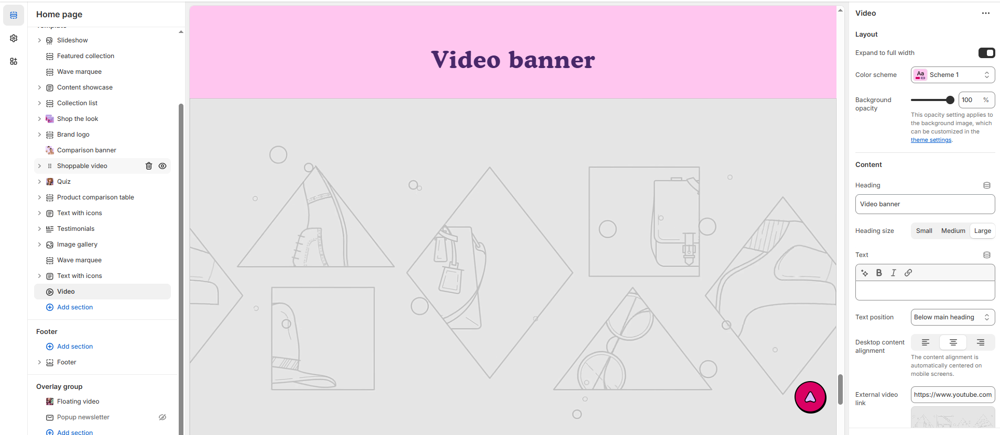

# Video Section

The **Video Section** allows you to embed and showcase videos in your store, providing an engaging way to present **brand stories, product demonstrations, or promotions**.

> **success:** 
1. **Go to** Shopify Admin > **Online Store > Themes**.
2. Click **Customize** on your active theme.
3. In the Theme Editor, click **Add Section > Video**.

<figure><figcaption></figcaption></figure>

### **Settings & Customization**

<figure><figcaption></figcaption></figure>

#### **Layout** 

* **Expand to Full Width:** Enable this option to extend the section across the entire screen width.
* **Color scheme:** You can customize the section’s appearance by changing the **text color, background color**, and more using **preset color** options.
* **Background Opacity:** Set the transparency level (Range: 0–100%, Default: 100%). This applies to the background image, which can be customized in the theme settings.

#### **Content Settings**

* **Heading:** Set a custom title (e.g., "Video Banner").
* **Heading Size:** Choose from **Small, Medium, or Large**.
* **Text :** Add additional text if needed
* **Text Position:**
  * **Above Main Heading** : Position the text above the heading.
  * **Below Main Heading** : Position the text below the heading.
* **Desktop Content Alignment:** Choose from **Left, Right, or Center** (Automatically centered on mobile screens).
* **External Video Link:** Use a YouTube or Vimeo URL. (Example: [YouTube Video](https://www.youtube.com/watch?v=_9VUPq3SxOc))
* **Shopify-Hosted Video:** Upload a video directly. (Selecting this option will override the external video link.)
* **Play Video on Loop:** Video plays continuously.
* **Enable Controls:** Show or hide video controls.

#### **Section Padding** 

* **Top Padding:** Adjust spacing above the section.
* **Bottom Padding:** Adjust spacing below the section.

#### Section divider

* **Shapes** : Adds shape effects to the section. Options: **( Curve Top, Curve Bottom, Curve Both, None, Border Top, Border Bottom, and Both Border)**.

