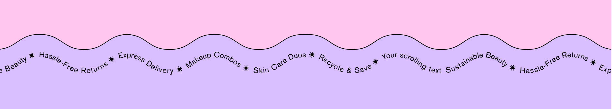
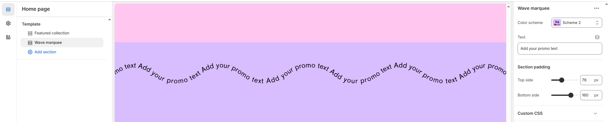

# Wave Marquee

The **Wave Marquee** section is a dynamic scrolling text feature that creates an engaging visual effect. It allows you to display important messages, promotions, or announcements in a continuous looping motion.

<figure><figcaption></figcaption></figure>


1. **Navigate to** Shopify Admin > Online Store > Themes.
2. **Click** Customize on your active theme.
3. **In the Theme Editor**, click **Add Section >** **Wave Marquee** .


### **Settings & Customization**

<figure><figcaption></figcaption></figure>

**Layout**&#x20;

* **Color scheme :** You can customize the section’s appearance by changing the **text color, background color**, and more using preset color options.
* **Text:** Enter the marquee text.

#### **Section Spacing**

* **Top Padding :** Adjust spacing above the section.
* **Bottom Padding :** Adjust spacing below the section.
