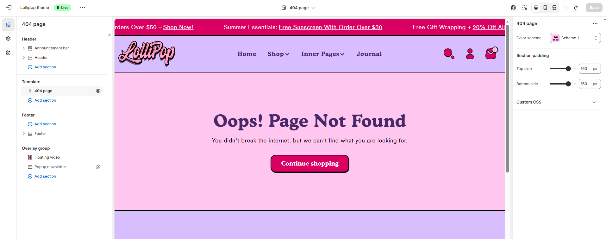

# Template - 404 Page

when a customer tries to visit a link to your site that doesn’t exist, such as a product page for a product that you deleted from your store.


* Go to **Customize** theme. Click on the top dropdown menu to select the **Others > 404 page** template.
* From the left side menu, select **“404 page”.**
* Customize this section by using the settings described in the following table:


<figure><figcaption></figcaption></figure>

**Color Scheme**: Customize the section’s appearance using preset text and background color options.

**Section Padding**

* **Top Padding:** Adjust spacing above the section.
* **Bottom Padding:** Adjust spacing below the section.
