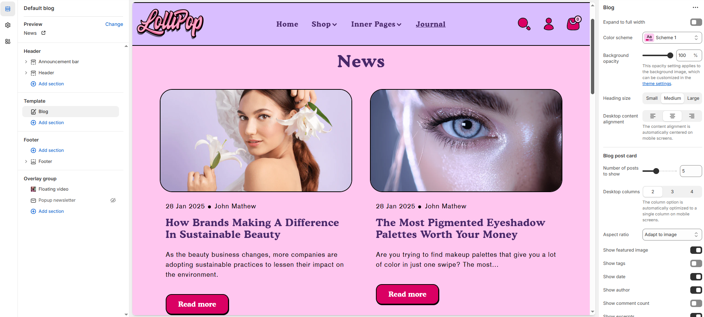

# Template- Blog

**Blog Template** is used to design and structure your blog listing page — where all your blog articles (posts) under a specific blog name (like "News" or "Journal") are displayed.


1. Go to **Online Store > Themes > Customize**
2. At the top dropdown, choose **Blogs > Default Blog**&#x20;
3. You’ll now be editing the **blog listing template**, not individual articles


<figure><figcaption></figcaption></figure>

**Blog**

<figure><figcaption></figcaption></figure>

* **Expand to Full Width**: Enable this option to extend the collections section across the entire screen width for a full-bleed layout.
* **Color Scheme**: Customize the section’s appearance using preset text and background color options.
* **Background Opacity**: Set the transparency level of the background image (Range: 0–100, Default: 100). This setting applies to the background image configured in the theme settings.
* **Heading Size**: Choose the heading size – Small, Medium, or Large (Default: Large).
* **Desktop Content Alignment**: Align the heading and subheading to the **Left**, **Center**, or **Right**. On mobile screens, content is automatically centered.

**Content Settings**

* **Number of Posts to Show**: Set the total number of blog posts to display in this section.
* **Desktop Columns**: Choose the number of columns on desktop device&#x73;**. (Options: 2, 3, or 4)**\
  Note: On mobile screens, the layout is automatically optimized to a single column for better readability.
* **Aspect Ratio**: Choose how the images are scaled – **Square**, **Portrait**, or **Adapt to Image** – depending on your theme style and product photography.
* **Show Featured Image**: Display the featured image for each blog post.
* **Show Tags**: Display associated tags for each post to highlight relevant topics.
* **Show Date**: Show the publish date of each blog post.
* **Show Author**: Display the author’s name for each post.
* **Show Comment Count**: Show the number of comments for each blog post.
* **Show Excerpts**: Display a short preview of the blog content.
* **Show Read More**: Include a “Read More” link to encourage users to continue reading the full post.
* **Enable Blog Filter**: Allow users to filter blog posts by category or tag (if supported by the theme).
* **Blog Column Alignment**: Adjust the horizontal alignment of blog cards within the section Options **Left, Center, Right.**

**Section padding**

* **Top Padding :** Adjust spacing above the section.
* **Bottom Padding :** Adjust spacing below the section.
