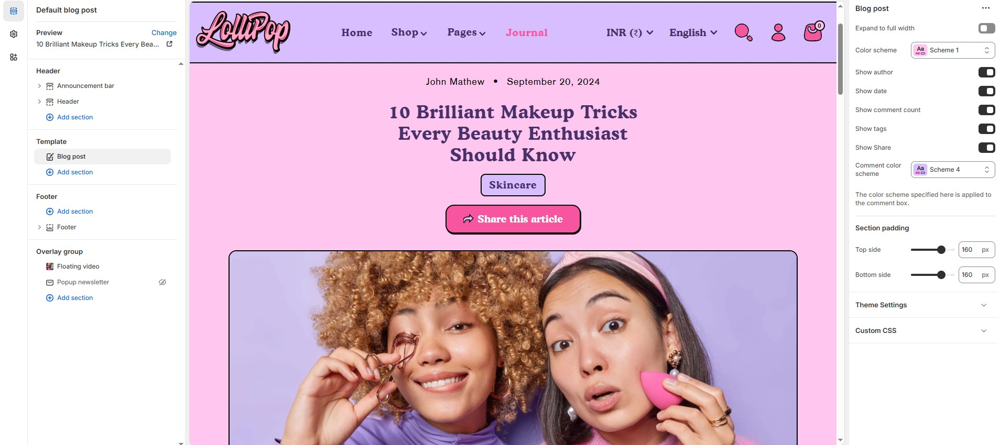

# Template- Default Blog Post

The **Default Blog Post** template in Shopify controls the layout and styling of each individual **blog article**


1. Go to **Online Store > Themes > Customize**
2. At the top dropdown, choose **Blogs Posts > Default Blog** Post
3. You’ll now be editing the **blog listing template**, not individual articles


**Blog**

<figure><figcaption></figcaption></figure>

* **Expand to Full Width**: Enable this option to extend the collections section across the entire screen width for a full-bleed layout.
* **Color Scheme**: Customize the section’s appearance using preset text and background color options.
* **Show Author**: Display the author’s name for each post.
* **Show Date**: Show the publish date of each blog post.
* **Show Comment Count**: Show the number of comments for each blog post.
* **Show Tags**: Display associated tags for each post to highlight relevant topics.
* **Show Share**: Display a short preview of the blog content.
* **Color Scheme**: Choose a preset color scheme for the comment box.

**Section padding**

* **Top Padding :** Adjust spacing above the section.
* **Bottom Padding :** Adjust spacing below the section.
