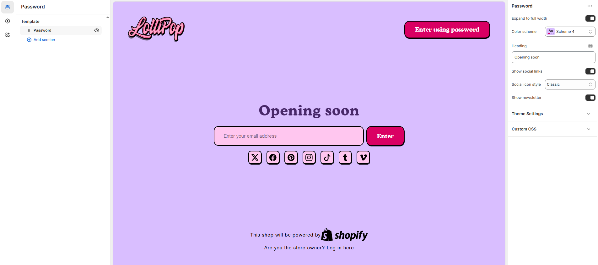

# Template - Password Page

The password page displays when password protection is enabled on your online store and a customer tries to visit your website

<figure><figcaption></figcaption></figure>

* **Expand to Full Width**: Enable this option to extend the collections section across the entire screen width for a full-bleed layout.
* **Color Scheme**: Customize the section’s appearance using preset text and background color options.
* **Heading :** Set a custom title (e.g., "Opening soon").
* **Show Social Link :** Toggle to show or hide social media icons below the newsletter signup form.
* **Social Icon Style :** Select the style for social icons – **Classic, Modern, or Default.**
* **Show Newsletter :** Show or hide newsletter Signup form.
