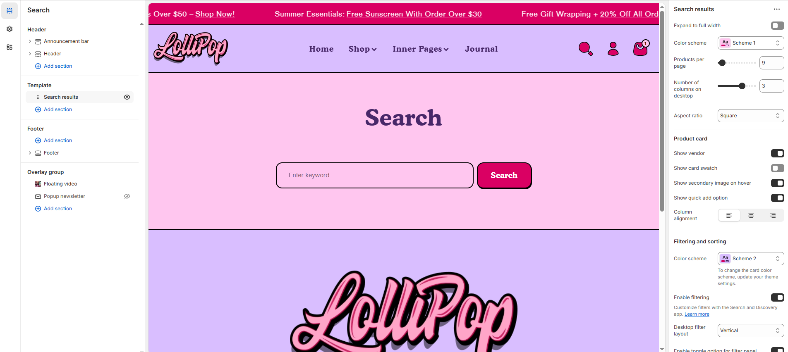

# Template - Search Result

The search page is where customers can search for specific products or pages within your online store. The page contains a **Search results** section by default.


* Go to **Customize** theme. Click on the top dropdown menu to select the **Others > Search** template.
* From the left side menu, select **“Search page”.**
* Customize this section by using the settings described in the following table:


<figure><figcaption></figcaption></figure>

* **Expand to Full Width**: Enable this option to extend the collections section across the entire screen width for a full-bleed layout.
* **Color Scheme**: Customize the section’s appearance using preset text and background color options.
* **Products Per Page**: Set how many products to display per page.
* **Number of Columns on Desktop**: Choose between 2, 3, 4, or more columns.
* **Aspect Ratio**: Choose how the images are scaled – **Square**, **Portrait**, or **Adapt to Image** – depending on your theme style and product photography.

#### **Product Card**

* **Show Vendor**: Display the product vendor or brand name.
* **Show Card Swatch**: Show variant swatches (e.g., colors).
* **Show Secondary Image on Hover**: Display alternate product image on hover.
* **Show Quick Add Option**: Enable a button for fast add-to-cart.
* **Content Alignment:** Choose from **Left, Right, or Center**.

#### Filtering and sorting

* **Color Scheme** : Customize the section’s appearance using preset text and background color options.
* **Enable Filtering :** Activate product filtering (customize via Search & Discovery app).
* **Desktop Filter layout :** Choose between Vertical (sidebar) , Horizontal or Drawer.
* **Enable toggle option for filter panel :** Enable to collapse filters initially on page load.
* **Enable sorting :**  Show sorting options (e.g., Featured, Price, Newest).
* **Show filter counts :**  Display the number of products under each filter.
* **Show product count :** Show total number of products in the collection.
* **Show active filters :** Display currently applied filters.
* **Pagination style :** Select how products are paginated  **Default, Loadmore and Scrolling.**

#### Blog card

* **Show featured image :**  Display the featured image for each blog post.
* **Show date :** Show the publish date of each blog post.
* **Show author :** Display the author’s name for each post.
* **Show excerpts :** Display a short preview of the blog content.
* **Show comment count :** Show the number of comments for each blog post.
* **Show readmore :** Include a “Read More” link to encourage users to continue reading the full post.
* **Blog column alignment :** Adjust the horizontal alignment of blog cards within the section Options **Left, Center, Right.**

#### Section padding

* **Top Padding :** Adjust spacing above the section.
* **Bottom Padding :** Adjust spacing below the section.
