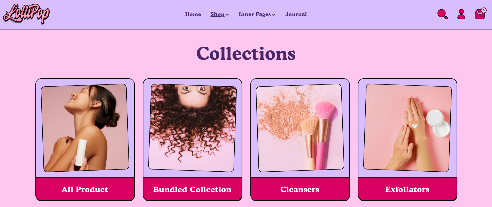

# Template Collection List Page

The **Collection list  section** is used to display a group of products from a specific **collection** (like "New Arrivals," "Best Sellers," or "Summer Collection") on a collection page.

> **success:** 
1. Go to **Online Store > Themes > Customize**
2. Click the **top dropdown menu**
3. Select **Collections > Default Collection**
4. On the **left sidebar**, click on **Collections list page**

<figure><figcaption></figcaption></figure>

### **Customize the** Collection list **Section**

<figure><figcaption></figcaption></figure>

#### **Collections List Page Settings**

**Layout**

* **Expand to Full Width**: Enable this option to extend the collections section across the entire screen width for a full-bleed layout.
* **Color Scheme**: Customize the section’s appearance using preset text and background color options.
* **Background Opacity**: Set the transparency level of the background image (Range: 0–100, Default: 100). This setting applies to the background image configured in the theme settings.

**Content Settings**

* **Heading**: Set a custom title (e.g., "Collections").
* **Heading Size**: Choose the heading size – **Small, Medium, or Large.**
* **Desktop Content Alignment**: Align the heading and subheading to the **Left**, **Center**, or **Right**. On mobile screens, content is automatically centered.

**Collection Card Settings**

* **Collections Posts Visible**: Define the number of collection cards shown.
* **Collection List Style**: Choose between **Classic** (traditional layout) or **Modern** (updated card style).
* **Enable Collection Description**: Display a short description under each collection title.
* **Enable Collection Count**: Show the number of products available in each collection.
* **Column Alignment**: Adjust how collection cards align within their columns.
* **Aspect Ratio**: Choose how the images are scaled – **Square**, **Portrait**, or **Adapt to Image** – depending on your theme style and product photography.
* **Sort Collections By**: Define the order in which collections appear (e.g., Alphabetically, A–Z).

**Column Settings**

* **Desktop Columns**: Select how many columns appear on desktop (Options: 3, 4, or 5).
* **Mobile Columns**: Select how many columns appear on mobile (Options: 1 or 2).

**Section padding**

* **Top & Bottom Padding:** Adjust the spacing above and below the section for a well-structured layout.

