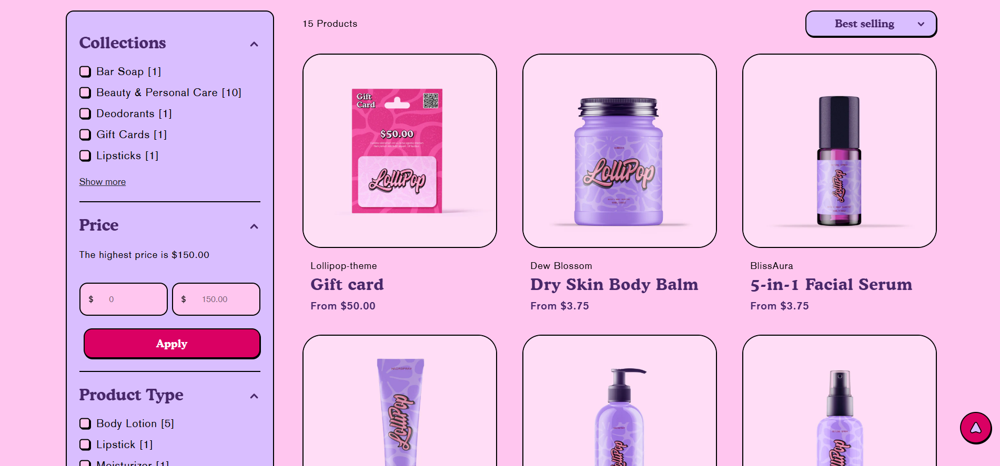
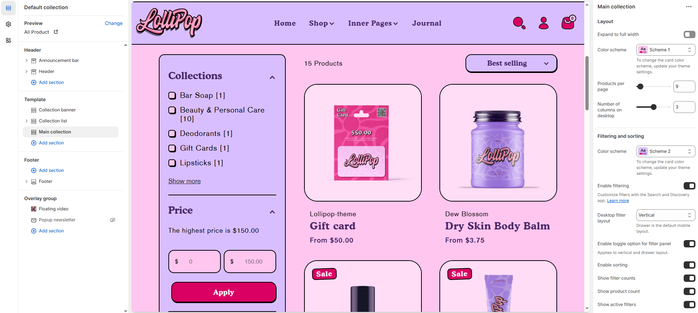

# Template Main collection

Explore our curated selection of best-selling and trending products, all in one place. Whether you're shopping for the latest arrivals or timeless essentials, our main collections bring you quality, style, and value. Handpicked with care, each item reflects our commitment to excellence and customer satisfaction.


1. Go to **Online Store > Themes > Customize**
2. Click the **top dropdown menu**
3. Select **Collections > Default Collection**
4. On the **left sidebar**, click on **Main collection**


<figure><figcaption></figcaption></figure>

### **Customize the** Collection list **Section**

<figure><figcaption></figcaption></figure>

**Layout**

* **Expand to Full Width**: Enable this option to extend the collections section across the entire screen width for a full-bleed layout.
* **Color Scheme**: Customize the section’s appearance using preset text and background color options.
* **Products Per Page**: Set how many products to display per page.
* **Number of Columns on Desktop**: Choose between 2, 3, 4, or more columns.

#### Filtering and sorting

* **Color Scheme**: Customize the section’s appearance using preset text and background color options.
* **Enable Filtering**: Activate product filtering (customize via Search & Discovery app).
* **Desktop Filter Layout**: Choose between **Vertical** (sidebar) , **Horizontal** or **Drawer**.
* **Filter Panel Closed by Default**: Enable to collapse filters initially on page load.
* **Enable Sorting**: Show sorting options (e.g., Featured, Price, Newest).
* **Show Filter Counts**: Display the number of products under each filter.
* **Show Product Count**: Show total number of products in the collection.
* **Show Active Filters**: Display currently applied filters.

#### **Product Card Settings**

* **Show Vendor**: Display the product vendor or brand name.
* **Show Quick Add Option**: Enable a button for fast add-to-cart.
* **Show Description**: Display a short product description.
* **Show Card Swatch**: Show variant swatches (e.g., colors).
* **Show Secondary Image on Hover**: Display alternate product image on hover.
* **Content Alignment:** Choose from **Left, Right, or Center**.
* **Aspect Ratio**: Choose how product images scale **Square**, **Portrait**, or **Adapt to Image** – depending on your theme style .
* **Pagination Style**: Select how products are paginated  **Default, Loadmore and Scrolling.**

**Section padding**

* **Top Padding :** Adjust spacing above the section.
* **Bottom Padding :** Adjust spacing below the section.

#### **Theme Settings**

* **Card Style**: Choose between **Classic** and **Modern** card designs (applies to product, collection, and blog cards).
* **Background Opacity:** Adjust transparency (Range: 0–100 %, Default: 100%). This applies to the background image, customizable in theme settings._._
* **Color Scheme**: Customize the section’s appearance using preset text and background color options.
* **Show Currency Codes**: Enable to display currency codes beside product prices.
* **Option Name to Show as Swatch**: Define swatch labels for variant options. Example: color, couleur, farbe (Variant option named 'Color' is automatically turned into swatches. If your store supports multiple languages, please enter all of the translations here. Separate options with a comma.e.g color,couleur,farbe).
