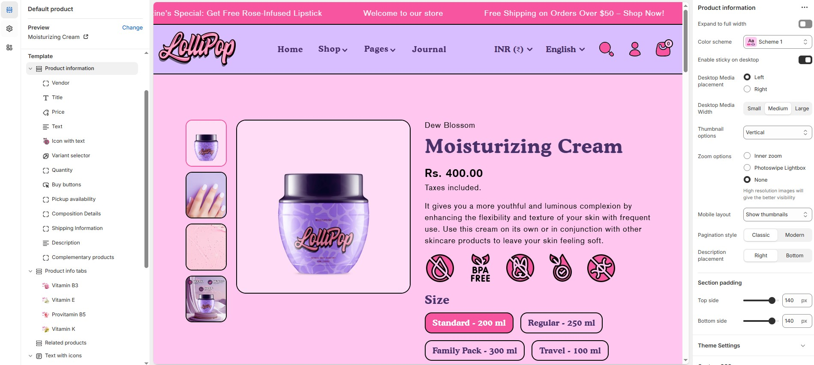

# Template product

The **Main Product** section in Shopify is where you configure how a product appears on the **product detail page** (PDP). It controls everything from product title and price to images, buttons, and more.

> **success:** 
1. Go to **Online Store > Themes > Customize**
2. In the theme editor, click the **top dropdown menu**
3. Select **Products > Default Product**
4. On the **left side panel**, click on **Product Informatin**

<figure><figcaption></figcaption></figure>

**Settings & Customization**

<figure><figcaption></figcaption></figure>

**Layout**

* **Expand to Full Width:** Enable this option to extend the section across the entire screen width.
* **Color scheme:** You can customize the section’s appearance by changing the **text color, background color**, and more using **preset color** options.
* **Enable Sticky on Desktop**: Keep the product information panel visible as users scroll down the page on desktop devices for better accessibility.
* **Desktop Media Placement :  Left / Right**: Choose whether the product media (images/videos) should appear on the left or right side of the screen on desktop.
* **Desktop Media Width**: Choose from **Small, Medium, or Large**
* **Thumbnail Options**: Stacked layout with Vertical or Horizontal thumbnail alignment.

**Zoom Options**

* **Inner Zoom**: Enable a zoom-on-hover effect within the image boundary for a closer look at product details.
* **Photoswipe Lightbox**: Open high-resolution product images in a lightbox overlay for enhanced viewing. Recommended for stores with detailed product visuals.
* **None**: Disable zoom functionality.

> Note: High-resolution images enhance visibility and user experience.

* **Mobile Layout**: Choose to **Hide Thumbnails** for a cleaner view or **Show Thumbnails** for easier image navigation on mobile devices.
* **Pagination Style**: Choose between **Classic** (traditional numbered pagination) or **Modern** (sleek, updated style).
* **Description Placement**: Position the product description on the **Right** or **Bottom** of the media section on desktop.

**Section padding**

* **Top Padding :** Adjust spacing above the section.
* **Bottom Padding :** Adjust spacing below the section.

**Theme Settings & Customization**

* Adjust additional styles in **Theme Settings**.
* Use **Custom CSS** for further design modifications.
